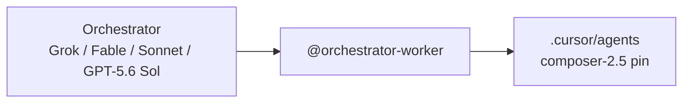

# Agent orchestration — Cursor IDE

**Grok 4.5** (default orchestrator) plans in Cursor Agent chat. **`composer-2.5[fast=false]`** workers run as subagents with explicit `model:` pins in `.cursor/agents/`. Other orchestrators (Fable 5, Sonnet 5, GPT-5.6 Sol) work the same way.

---

## What goes where

| Piece                 | Location                                       | How it gets there                                                      |
| --------------------- | ---------------------------------------------- | ---------------------------------------------------------------------- |
| Procedure + templates | fixmyskills `agent-orchestration`              | Skills CLI → `.agents/skills/`                                         |
| Worker model pins     | `.cursor/agents/implementer.md`, `verifier.md` | `init-cursor.sh`                                                       |
| Orchestrator behavior | `.cursor/rules/orchestrator-worker.md`         | `init-cursor.sh`                                                       |
| Parent model          | Cursor Agent model picker                      | You pick an orchestrator each session                                  |
| Personal workers      | `~/.cursor/agents/`                            | Manual copy — see [cursor-personal-setup.md](cursor-personal-setup.md) |



Skills CLI does **not** install `.cursor/agents/` — run `init-cursor.sh` after `bunx skills add`.

---

## Bootstrap (one-time per repo)

```bash
bunx skills add FixMyBerlin/fixmyskills --skill agent-orchestration -a cursor -y
bash .agents/skills/agent-orchestration/scripts/init-cursor.sh
git add .cursor/agents .cursor/rules skills-lock.json
git commit -m "Add Cursor agent orchestration setup"
```

`TARGET_REPO=/path` overrides destination.

Reset templates: re-run `init-cursor.sh` (overwrites).

---

## Picking an orchestrator

| Model           | Good for                                                                                                                                       |
| --------------- | ---------------------------------------------------------------------------------------------------------------------------------------------- |
| **Grok 4.5** ⭐ | **Default.** Long-running, multi-step work; Cursor's first-party orchestrator (shares included usage pool with Composer). Not available in EU. |
| **Fable 5**     | Complex, long-running, multi-step agentic work; highest capability                                                                             |
| **Sonnet 5**    | Everyday coding with strong multi-step reasoning and reliable tool use                                                                         |
| **GPT-5.6 Sol** | Long-running agent work; can over-delegate on mid-sized tasks — keep one `/implementer` per cohesive task                                      |

Workers stay on **`composer-2.5[fast=false]`** regardless of orchestrator choice.

---

## Daily usage

1. Pick **Grok 4.5** as orchestrator (or Fable 5 / Sonnet 5 / GPT-5.6 Sol).
2. Attach **`@orchestrator-worker`** and state your task — nothing else required:

```
@orchestrator-worker
Fix the parking map zoom bug.
```

The rule is the complete orchestration instruction. Do **not** paste delegation boilerplate ("orchestrate only", "omit Task model", etc.) — those live in `.cursor/rules/orchestrator-worker.md`.

Workers use **`composer-2.5[fast=false]`** automatically via `.cursor/agents/` frontmatter.

**Skip** `@orchestrator-worker` for trivial one-file edits — subagent startup costs more than inline work.

---

## Delegation

| Task                                       | Delegate to                    |
| ------------------------------------------ | ------------------------------ |
| Codebase search                            | Built-in `explore`             |
| Edits, tests, installs, state-changing git | `/implementer`                 |
| Read-only diagnostics (logs, status)       | Built-in `bash`                |
| Post-change validation                     | `/verifier` (readonly)         |
| Browser / UI                               | `browser` or agent-browser MCP |

Invocation: `/implementer [scoped brief]`, `/verifier [what to prove]`. For parallel work, send multiple subagent Task calls in one message.

Orchestrator may inline only trivial fixes (~10 lines) or when user says "no subagents".

---

## Worker model pins

`.cursor/agents/` frontmatter: `model: composer-2.5[fast=false]` (non-fast / standard Composer). Equivalent: `composer-2.5[]`. Verifier adds `readonly: true`. **Avoid** `inherit` on workers — bills at your orchestrator's rate.

### Task tool vs frontmatter (common fast-mode bug)

The Task tool's inline `model` parameter only exposes **`composer-2.5-fast`** for Composer. Passing any inline `model` on `/implementer` or `/verifier` **overrides** the frontmatter pin and forces fast — saying "slow" in the prompt does nothing.

**Fix:** when spawning custom workers, use `subagent_type: implementer` or `verifier` and **omit `model` entirely**. The frontmatter pin then applies `composer-2.5[fast=false]`.

| Spawn style                                    | `model` on Task call | Result                        |
| ---------------------------------------------- | -------------------- | ----------------------------- |
| `/implementer`, no inline model                | omitted              | `composer-2.5[fast=false]` ✅ |
| Task + `model: composer-2.5-fast`              | set                  | **fast** ❌                   |
| Task + `model: composer-2.5` or `[fast=false]` | set                  | rejected or unpredictable ❌  |
| `generalPurpose` + inline Composer             | set                  | **fast** ❌                   |

Built-in `explore` is for search only and does **not** read `.cursor/agents/` frontmatter — it uses Cursor's own default (typically a faster model). Still **omit** Task inline `model` for explore (do not force `composer-2.5-fast`). For `/implementer` and `/verifier`, omit `model` so the frontmatter pin `composer-2.5[fast=false]` applies.

Parallel subagents = parallel token spend. Cursor may fall back from a pinned worker model when blocked by admin, unavailable Max Mode, or plan limits.

---

## Customize & verify

- Edit copied files in the target repo (`verifier.md` check commands, rule delegation for MCP, etc.). Do **not** put orchestration in global Cursor User Rules — attach `@orchestrator-worker` per task (rule only; no boilerplate in the prompt).
- Verify: `@orchestrator-worker` in rule picker; attaching it alone switches parent to orchestrate-only; `/implementer` and `/verifier` show `composer-2.5[fast=false]` in frontmatter; parent spawns them **without** Task inline `model`.

---

## References

- [Cursor Subagents](https://cursor.com/docs/subagents)
- [Grok 4.5](https://cursor.com/docs/models/grok-4-5)
- [Claude Fable 5](https://cursor.com/docs/models/claude-fable-5)
- [Claude Sonnet 5](https://cursor.com/docs/models/claude-sonnet-5)
- [GPT-5.6 Sol](https://cursor.com/docs/models/gpt-5-6-sol)
- Prototype: tilda-geo commit `9572b85`
