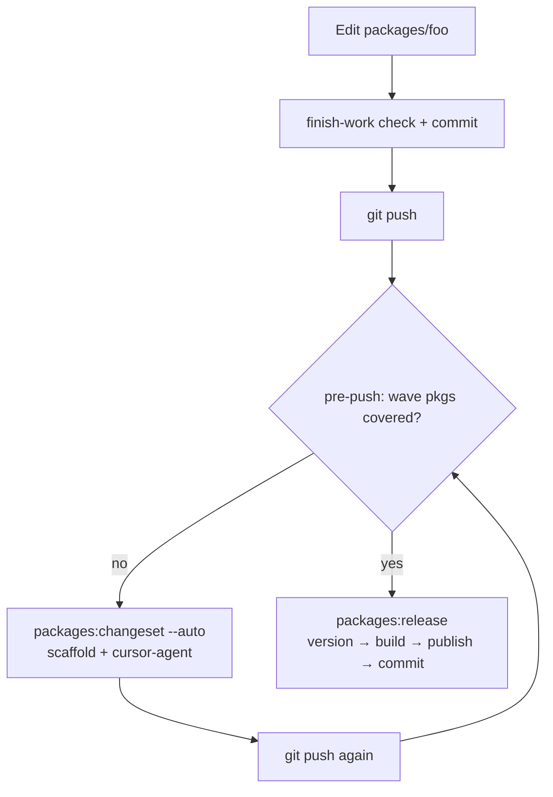

# Kit package versioning & alpha publish

This monorepo uses [Changesets](https://github.com/changesets/changesets) for versions. Interactive `bunx changeset` is **not** the happy path — use the scripts below.

Wave packages always bump **`patch`** while in alpha. npm dist-tag: **`alpha`**.

## Wave packages

- `@osm-editor-kit/osm-coverage`
- `@osm-editor-kit/osm-data`
- `@osm-editor-kit/osm-map-url`
- `@osm-editor-kit/osm-maplibre`
- `@osm-editor-kit/osm-route-snapper`
- `@osm-editor-kit/osm-way-chain`
- `@osm-editor-kit/street-imagery`
- `@osm-editor-kit/street-imagery-react`

Other kit packages stay private. Draft notes: [`docs/changeset-pending-private/`](../docs/changeset-pending-private/). The app is `private` and ignored.

## Flow



## Day to day

1. Land package work with finish-work (user-facing commit messages).
2. Optionally run `bun run packages:changeset -- --auto` before the first push.
3. `git push` — pre-push runs `packages:changeset --auto` if wave packages in `@{upstream}..HEAD` lack a pending changeset. If it commits one, **push again**.

Bypass (rare): `SKIP_PACKAGE_CHANGESET_AUTO=1 git push` or `git push --no-verify`.

## Ship alphas

```bash
bun run packages:release
# or
bun run packages:release -- --yes
bun run packages:release -- --dry-run
bun run packages:release -- --publish-only   # already versioned + built
bun run packages:check
```

`packages:release` will:

1. Ensure changeset coverage (`--auto` if needed)
2. `changeset version` (patch bumps + CHANGELOGs)
3. `build:packages`
4. Readiness checks (auth, dist, already-on-npm, …)
5. Confirm and `npm publish --tag alpha` (TTY for 2FA / EOTP)
6. Commit version bumps (does not push)

## Changeset commands

```bash
# Scaffold from commits (patch frontmatter + commit bullets)
bun run packages:changeset

# Check only (exit 1 if uncovered)
bun run packages:changeset -- --check

# Scaffold + cursor-agent rewrite + commit (exit 2 → push again)
bun run packages:changeset -- --auto
```

Agent uses `composer-2.5` by default (`OSM_CHANGESET_AGENT_MODEL` to override). Requires `cursor-agent` (or `agent`) on PATH and login / `CURSOR_API_KEY`.

## Install in other apps

```bash
bun add @osm-editor-kit/street-imagery@alpha
```
