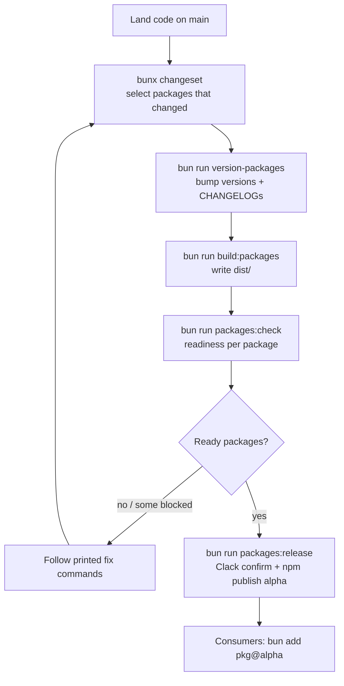

# Kit package versioning & alpha publish

This monorepo uses [Changesets](https://github.com/changesets/changesets) for versions and a small Clack CLI for **publish checks**.

**Prepare** (version + build) and **release** (validate + npm publish) are separate on purpose.

## Wave packages (first npm alpha)

- `@osm-editor-kit/osm-coverage`
- `@osm-editor-kit/osm-data`
- `@osm-editor-kit/osm-map-url`
- `@osm-editor-kit/osm-maplibre`
- `@osm-editor-kit/osm-route-snapper`
- `@osm-editor-kit/osm-way-chain`
- `@osm-editor-kit/street-imagery`
- `@osm-editor-kit/street-imagery-react`

Other kit packages stay private for now. Draft notes live in [`docs/changeset-pending-private/`](../docs/changeset-pending-private/). The app is `private` and ignored.

## Should bumps be per package?

**Yes — bump only what changed.** Changesets is designed that way:

| Situation | What to do |
| --- | --- |
| One package changed | `bunx changeset` → select **that** package → patch/minor |
| Several packages ship together (e.g. `street-imagery` + `street-imagery-react`) | One changeset can list **multiple** packages with the same bump + summary |
| First alpha / many packages at once | Still fine to list several in one changeset — but do not invent bumps for packages with no changes |

The release CLI does **not** ask for bumps or changelog text. That belongs in prepare (`bunx changeset` / `version-packages`).

## Flow



## Commands

### Prepare

```bash
# 1) Record what changed (interactive; pick packages individually or as a group)
bunx changeset

# 2) Apply pending changesets → package.json versions + CHANGELOG.md
bun run version-packages

# 3) Build dist/ for the wave (required before publish)
bun run build:packages

# One-time (already done for this repo): stay in alpha prerelease mode
bunx changeset pre enter alpha
```

### Check / release

```bash
# Validate only — prints ready vs skipped + exact fix commands
bun run packages:check

# Validate, then publish only packages that pass (skips the rest)
npm login   # if npm whoami fails
bun run packages:release

# Non-interactive / CI-ish
bun run packages:release -- --yes
bun run packages:release -- --dry-run
```

`packages:release` will:

1. Check global preconditions (alpha pre mode, `npm whoami`)
2. Per wave package: private flag, alpha version, `publishConfig`, `publishExports`, `dist/`, pending changesets, “already on npm?”
3. **Skip** packages that fail and print a `→` fix command for each issue
4. Confirm (Clack) and `npm publish --tag alpha` **only** for ready packages

## Install in other apps

```bash
bun add @osm-editor-kit/street-imagery@alpha
# or pin: 0.1.0-alpha.0
```
