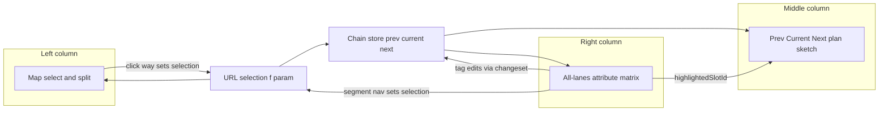
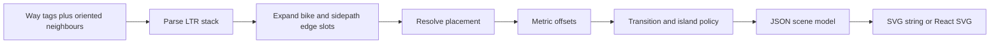
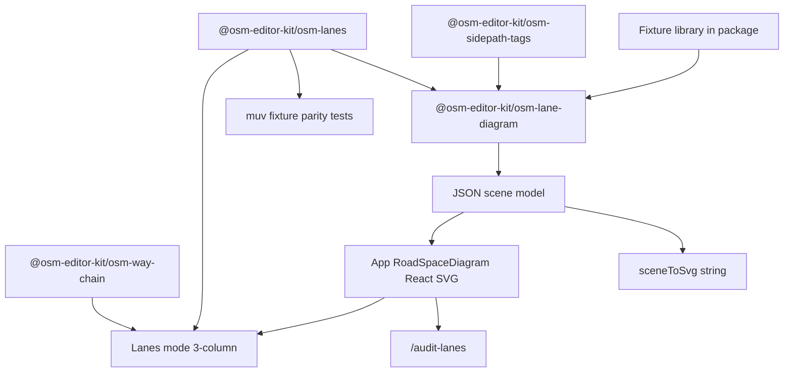

# Lanes Mode: Three-Column Redesign

## Goals

1. **Rework Lanes mode now** into a three-column editor: **map** owns spatial work (select, later split), **middle** is a render-only Level-B plan sketch of prev/current/next, **right** is an **all-lanes attribute matrix** with cell flyouts. Form focus/hover highlights the matching lane in the middle. Old bottom-panel chip UI is removed, not kept in parallel.
2. **Ship `@osm-editor-kit/osm-lane-diagram`** — a reusable, app-agnostic, **pure-TS** layout engine: tags → scene model → SVG. Aligned with the pipeline in [research/lane-rendering](research/lane-rendering/README.md).
3. **Build a first-class test-case library + `/audit-lanes` gallery** (sibling of shipped [`/audit-width`](app/src/routes/audit-width.tsx)) for curated street situations, with serializable scenes so review, snapshots and unit tests share one artefact.
4. **Stay embedded in the existing stack**: [`@osm-editor-kit/osm-lanes`](packages/osm-lanes/) stays the parse/serialize source of truth, [`osm-way-chain`](packages/osm-way-chain/) supplies the chain and direction normalisation, [`osm-sidepath-tags`](packages/osm-sidepath-tags/) supplies edge/sidepath expansion. muv-osm is a parity gold standard via fixtures, not a runtime dependency.
5. **Apply the width measurement rules** from [research/width-measurements](research/width-measurements/README.md) (and the teaching figures on `/audit-width`) when calculating and soft-validating lane-related width tags — without merging the two SVG systems.

## Research grounding

Primary rendering: [research/lane-rendering/00-research-question.md](research/lane-rendering/00-research-question.md) + [methods-catalogue.md](research/lane-rendering/methods-catalogue.md) (pipeline §1–2, islands/junctions §3, bike/sidewalk §4, abstraction levels §5, build order §6, panel rendering §7). Tags/projects: [research/lane-editor-tags/](research/lane-editor-tags/).

**Width semantics (binding for this plan):** [research/width-measurements/README.md](research/width-measurements/README.md) — especially verdict table, §2.1–2.2 (`width` / `width:lanes`), §2.6–2.8 (side features / cycle / buffer), §3 reconciliation scenarios, §4 soft checks. In-app teaching of those rules already ships as [`/audit-width`](app/src/routes/audit-width.tsx) + [`measure-guide/`](app/src/modes/width/measure-guide/) (panel + audit share one section registry).

**Abstraction target = Level B (semantic lane stack)** (catalogue §5) — coloured/access slots, turn arrows, bike separation, metric widths. Not Imagico/Map Machine equal-tick casement alone (A), not Seidel architecture-plan with kerbs/ALKIS (C), not AV HD lane graphs (D).

**Ecosystem decisions we adopt:**

| Decision | Choice | Why |
| --- | --- | --- |
| Parse / tags round-trip | Keep TS [`@osm-editor-kit/osm-lanes`](packages/osm-lanes/) | Editor source of truth; already wired to the changeset path |
| Parse gold standard | muv-osm / osm2streets `get_lane_specs_ltr` via **fixtures + parity tests** | Shared semantics without runtime coupling (catalogue §7.3) |
| osm2streets-js / WASM network render in panel | **No** | Heavy graph transforms; wrong UX for editing one way (§7.4) |
| Dual carriageway / island | **SRK spreading**, OSM topology untouched | Local + tag-driven; A/B Street `MergeDualCarriageways` rewrites the graph (§3.2) |
| Complex junctions | Butt-end / soft break; no connectivity solver | SRK: turn connectivity through junctions still unsolved (§3.3) |
| Draw language | TS → JSON scene → (a) SVG **string** serializer, (b) app React SVG | One segment is ms-work; string output makes tests/docs/sharing trivial |
| Panel presentation | SVG plan sketch + matrix form, **not** HTML chips (§7.1/7.2) and not osm_viewer's single-lane inspector | Continuity across segments is the differentiator |
| Width defaults | SRK Berlin-ish: car **3.0 m**, cycle **1.5 m**, parking **2.2 m**, sidewalk **2.0 m** | Prefer tagged widths over defaults; mark defaults as provenance `default` |
| Width measurement rules | **Share** research `/audit-width` semantics; **do not** reuse the width `CrossSection` SVG | Teaching dimensions ≠ plan-sketch layout (see below) |
| Audit routes | Flat `/audit-lanes` ↔ `/audit-width` | Same naming scheme; About / README discovery; no `/dev` prefix |

---

## Target design



| Column | Job | Interaction |
| --- | --- | --- |
| **Left — Map** | Select way; camera reframes to a vertical corridor. Not a lane diagram. | Click way; pan/zoom; split later (out of scope now) |
| **Middle — Diagram** | Level-B plan sketch of prev / current / next; continuous edges; metric widths | **Render-only**: no clicks, no hit-testing, no hover affordance. Only input is `highlightedSlotId` |
| **Right — Form** | All lanes of the current segment at once (matrix); cell flyouts; way-level block; segment nav | Edits go through the existing changeset path; focus/hover sets the highlight |

**Interaction rule (hard):** middle never opens an editor and never changes selection. Map owns geometry/selection. Form owns every attribute edit and segment navigation.

Production shell: stop mounting [`LanesBottomPanel`](app/src/modes/lanes/LanesBottomPanel.tsx); in [`MapPage`](app/src/shell/map/MapPage.tsx) render map + middle + right when mode is `lanes` and a way is selected.

### Form UX vs A/B Street osm_viewer

[osm_viewer](https://play.abstreet.org/0.3.49/osm_viewer.html) (muv/osm2streets under the hood; note in [abstreet-osm-viewer.md](research/lane-editor-tags/projects/abstreet-osm-viewer.md)) lets you hover/click each lane and shows a **single-lane inspector**. Good for QA of interpreted geometry, wrong for our edit flow.

**Keep:** the visual coupling between a lane in the sketch and the attribute being edited.
**Diverge:** the right column shows **all lanes at once** as a matrix (columns = LTR slots incl. edge slots; rows = attributes); per-lane edits open in **flyouts** instead of narrowing the panel to one lane.

```text
              | sidewalk L | cycleway L | lane1 | lane2 | lane3 | sidewalk R |
turn          |     —      |     —      |  ↑    | ↑→    |  →    |     —      |
width (m)     | 2.0*       | 1.5*       | 3.0   | 3.0   | 3.0   | 2.0*       |
surface       | asphalt    | asphalt    | —     | —     | —     | asphalt    |
smoothness    | good       | —          | —     | —     | —     | good       |
vehicle       |     —      |     no     | yes   | yes   | yes   |     —      |
bicycle       |     —      | designated | yes   | yes   | yes   |     —      |
```

`*` = default width (provenance `default`), rendered visually distinct from tagged values in both matrix and diagram. Way-level fields sit in a block above the matrix, never as per-lane cells.

---

## Data & orientation contract

This section is the part that makes "continuous edges" actually true. Implement it before layout.

1. **Selection source of truth** = URL feature param via [`useFeatureSelection` / `useSelectedOsmRef`](app/src/shell/map/feature-selection.tsx). Middle and right both derive from it; neither holds its own copy.
2. **Chain** = [`useLanesChainBuilder` / `useVisibleChainSegments`](app/src/modes/lanes/domain/use-lanes-chain.ts) (`maxPerSide: 3`, road-like filter). The diagram consumes exactly `[prev, current, next]`.
3. **Direction normalisation (required):** neighbour tags must be re-expressed in the current way's direction with [`normalizeTagsForDirection` / `orientNeighbor` / `swapLeftRightKey`](packages/osm-way-chain/src/traversal/direction.ts) before parsing. Without it, a neighbour digitised the other way renders mirrored (`:forward`/`:backward`, `left`/`right` swapped) and every continuity invariant breaks.
4. **Screen order:** which neighbour is drawn above vs below uses the same rule as today's cross-section columns — [`screenOrderedChainNeighbors(prev, next, center, bearing)`](app/src/modes/lanes/domain/screen-ordered-neighbors.ts) — so the sketch matches what the map shows. Diagram stacks vertically: screen-up neighbour on top.
5. **Slot id scheme (shared vocabulary of diagram + form + highlight):**
   - carriageway slot: `way/<id>/lane/<direction>/<index>` (`direction` ∈ `forward | backward | both_ways`, `index` from `LaneSlot.index`)
   - edge/sidepath slot: reuse [`formatSidepathFeatureId`](packages/osm-sidepath-tags/src/index.ts) → `way/<id>/cycleway/left`, `way/<id>/sidewalk/right`
   - Ids are stable across re-layout, so `highlightedSlotId` survives edits; unknown ids are ignored silently.
6. **Store additions** ([`lanes-map-store.ts`](app/src/modes/lanes/map/lanes-map-store.ts)): `highlightedSlotId: string | null` + action, cleared by `clearLanesState`. Reuse of `selectedSlot` is not enough — highlight is transient (hover/focus) and must not drive an editor.
7. **Edits** keep the existing path: form → `useLanesModeHandlers().commitLaneModel/commitSlotUpdate` → `commitLaneModelToWay` → `useOsmChangeHandler('lanes')`. No new commit mechanism.
8. **Read-only**: when `authState !== success`, matrix cells are disabled and the login callout stays (as today in the bottom panel).

### Slot model (what a "slot" is)

`WayLaneModel.slots` only covers carriageway lanes. The diagram needs an **extended stack**:

| Slot source | Comes from | Written back via |
| --- | --- | --- |
| Carriageway lanes | `parseWayLanes()` slots (`lanes*`, `*:lanes` pipes) | `serializeWayLanes()` |
| On-carriageway cycle lane | `cycleway:*=lane` / `cycleway:lanes` expansion | `nestSideTags()` (side keys) |
| Sidewalk / sidepath / shared path | [`expandSidepaths()`](packages/osm-sidepath-tags/src/index.ts) | `nestSideTags()` |
| Kerbside parking | out of scope (sibling parking mode) | — |

Every slot carries `provenance: 'tagged' | 'default' | 'inferred'`, mirroring `LaneSlotProvenance` in `osm-lanes`. **Rule:** untagged sidewalks are **not** invented in the live editor — no `sidewalk=*` means no edge slot, plus a "sidewalk unknown" affordance in the form. Only fixtures may state sidewalks explicitly. Defaults are for *widths*, not for *existence*.

---

## Middle column — short-segment plan sketch

Pipeline per [methods-catalogue §1–2](research/lane-rendering/methods-catalogue.md):



1. **Parse LTR stack** — motor slots from `lanes*` / pipes. Bike lanes are **not** in `lanes=*` and must be expanded in; bus lanes **are** counted in `lanes=*`.
2. **Expand edge slots** — sidewalks/sidepaths/shared paths from side tags (tag-only offsets; no Sidewalkreator-style zipping in v1).
3. **Resolve placement** — `left_of:N` / `right_of:N` / `middle_of:N` / `transition`; SRK defaults when absent (odd lane count → `middle_of:ceil(lanes/2)`, even → `left_of:(lanes/2 + 1)`). Anchor shifts the stack relative to the centreline marker.
4. **Metric thicken/offset** — offsets summed from the placement anchor; single shared m→px scale for all three segments. Slot widths come from tagged **clear** widths (`width:lanes` pipes for flowing slots; `cycleway:*:width` / `sidewalk:*:width` for edge slots) else SRK defaults. Separator strokes are **cosmetic** (fixed px / thin polylines), not DE paint millimetres — paint enters soft validation in the form, not the layout sum. Emit fills + separator polylines.
5. **Transitions** — taper rules must be explicit: the changing side gets the taper, anchored so the *unchanged* outer edge stays a straight continuous line; a lane added/dropped on the right tapers on the right. The taper lives in the **current** segment's band (top or bottom third depending on which neighbour differs) so the current cross-section stays readable. `placement=transition` linearly interpolates the anchor.
6. **Islands** — `dual_carriageway=yes` next to a non-dual same-name neighbour → **spread** into two carriageway groups with a median gap so markings run past the median (§3.2). Fork discovery is explicit: sibling way from the chain with matching `name`/`ref` and near-parallel bearing; if only one carriageway is selected, draw the selected side solid and the sibling as a dimmed group. Never call anything like `MergeDualCarriageways`.
7. **Junctions** — T/cross: butt-end caps and a soft break; stubs dimmed. No turn-lane connectivity, no `area:highway` cut-out (the map already shows topology).
8. **Style** — turn glyphs from `turn:lanes`; solid/dashed separators from `change:lanes` / `lane_markings=no`; bike colour for designated slots; `provenance: 'default'` widths drawn with a subdued hatch/outline.
9. **Highlight** — scene slots expose their id; the renderer styles `highlightedSlotId` (and optionally dims siblings). Visual only.

**Continuity invariants (testable, not prose):**

- Outer left/right kerb x at the bottom edge of the upper segment equals the x at the top edge of the lower segment (±0.01 px) whenever no taper is declared between them.
- Where two adjacent segments have equal lane counts and widths, their separator x-positions are identical sets.
- Sum of **slot clear widths** equals the carriageway band's clear-stack width (cosmetic separator strokes do not add metres).
- Slot ids are unique per segment; every slot has non-zero width.

### Left map camera

On segment change, animate MapLibre `easeTo` so the selected way reads as a straight vertical corridor:

- **Bearing** from the dominant way direction ([`way-side-order.ts`](app/src/modes/parking/domain/way-side-order.ts) / [`screen-ordered-neighbors.ts`](app/src/modes/lanes/domain/screen-ordered-neighbors.ts)); prefer the option closer to current bearing to avoid 180° flips.
- **Pitch** ~40–55°. Requires lifting the hard `maxPitch={0}` / `pitchWithRotate={false}` / `touchPitch={false}` in [`MapPage`](app/src/shell/map/MapPage.tsx) **for lanes mode only**; other modes keep flat 2D.
- Replace the bounds-only fly-to in [`use-lanes-fly-to-way.ts`](app/src/modes/lanes/use-lanes-fly-to-way.ts) for this mode.
- **Escape hatch + no camera loops:** auto-camera runs once per selection change (keyed by way id), never on graph refetch or viewport change; a manual pan/rotate suppresses auto-orientation until the next selection change; URL `map` param keeps recording the resulting view as today.

### Right form — all-lanes matrix + flyouts

- **Way-level block:** `oneway` (+ `oneway:bicycle`), `lanes` / `lanes:forward` / `lanes:backward` / `lanes:both_ways`, **`width` / `est_width`** (carriageway kerb→kerb), `placement`, `lane_markings`, `dual_carriageway`, sidewalk/cycleway presence (adds/removes edge columns), `segregated` when a shared sidepath exists, plus a **soft width sum strip** (see Width calculation).
- **Matrix:** one column per LTR slot (edge slots included), rows = attributes; cell shows the current value and its provenance; click opens a flyout (Headless UI `Popover`, matching existing panel components).
- **Segment nav:** prev/current/next in the form (plus existing arrow-key walk), never via middle clicks.
- **Focus sync:** hover or keyboard focus on a column/cell sets `highlightedSlotId`; blur/close clears it. Pointer hover must not fight keyboard focus (focus wins).
- Replaces [`LanesSlotEditor`](app/src/modes/lanes/components/LanesSlotEditor.tsx) free-text single-slot editing and [`LaneCrossSection`](app/src/modes/lanes/components/LaneCrossSection.tsx) chips.

#### Tag coverage and write paths

Grouped, with the write path made explicit — this is where the current serializer falls short.

| Group | Tags in scope | Write path |
| --- | --- | --- |
| Lane counts / direction | `lanes`, `lanes:forward`, `lanes:backward`, `lanes:both_ways`, `oneway`, `oneway:bicycle` | `serializeWayLanes` (exists) |
| Carriageway width | `width`, `est_width` (+ display `source:width`) | plain way tags (same as width mode); **not** via `serializeWayLanes` |
| Turns | `turn:lanes` (+ `:forward` / `:backward`) | `serializeWayLanes` (exists) |
| Access per lane | `vehicle:lanes`, `bicycle:lanes`, `bus:lanes`, `psv:lanes` (+ directional) | `serializeWayLanes` (exists) |
| Geometry per lane | `width:lanes` (+ directional), `placement`, `placement:forward/backward` | `serializeWayLanes` (exists) |
| Markings | `lane_markings`, `change:lanes` | `lane_markings` exists; **`change:lanes` needs adding** to `serializeWayLanes` + `PRIMARY_LANE_KEYS` |
| Per-lane quality | `surface:lanes`, `smoothness:lanes` | **needs adding** to parse + serialize, or cut from v1 |
| On-carriageway bike | `cycleway`, `cycleway:left/right`, `cycleway:lanes`, `cycleway:*:width`, numeric `cycleway:*:buffer` | `nestSideTags` |
| Sidewalk | `sidewalk`, `sidewalk:left/right`, `sidewalk:*:width`, `sidewalk:*:surface`, `sidewalk:*:smoothness` | `nestSideTags` |
| Shared bike + foot sidepath | `segregated`, `cycleway:*:surface`, `footway:*:surface` (+ path `cycleway:width` / `footway:width`) | `nestSideTags` |
| Dual carriageway | `dual_carriageway` | plain way tag |
| On-street parking widths | `parking:*:width` | **read for soft validation only** in lanes mode (edits stay in parking mode) |

**Explicitly excluded:** `foot:lanes` (not real-world tagging). Pedestrians on the carriageway without a sidewalk are shown by *absence* of edge slots, not by a foot lane. Parking **slots** stay in the parking mode (not drawn / not editable here); parking **widths** still feed the soft sum when present on the way.

**Rule:** a matrix row ships only when its write path exists and round-trips (parse → edit → serialize → parse is stable). Rows whose write path is not implemented are read-only display or deferred — never a silently dropped edit.

---

## Width calculation & validation (align with `/audit-width`)

Shipped teaching surface: [`/audit-width`](app/src/routes/audit-width.tsx) + [`app/src/modes/width/measure-guide/`](app/src/modes/width/measure-guide/) (specs in [`specs.ts`](app/src/modes/width/measure-guide/specs.ts), section registry in [`sections.ts`](app/src/modes/width/measure-guide/sections.ts)). Research source of truth: [research/width-measurements/README.md](research/width-measurements/README.md).

### What to share vs what to keep separate

| Concern | Owner | Lanes plan does |
| --- | --- | --- |
| Measure attach rules (`clear` vs `inclusive`), paint-in-buffer, kerb→kerb `width=*` | width research + `/audit-width` figures | **Adopt as binding semantics** for form warnings and help copy |
| Teaching cross-section SVG (`CrossSection` / measure arrows / Randsteine) | width mode only | **Do not import** into `@osm-editor-kit/osm-lane-diagram` or the plan sketch |
| Plan-sketch layout (prev/current/next continuity, placement, forks) | this package | Own scene model; uses clear slot metres, cosmetic separators |
| Soft sum / inconsistency warnings | both modes | Implement once as a small pure helper (prefer `packages/` or shared `app` util) so lanes form and (later) width panel stay consistent |
| Audit route naming / discovery | both | `/audit-lanes` ↔ `/audit-width`; About link + README **Audit** subsection; header sibling link |

### Binding measurement rules (for lanes tagging)

1. **`width=*` / `est_width=*`** = carriageway **kerb→kerb** (edge→edge). Includes on-carriageway parking and on-carriageway cycle lanes; **excludes** sidewalks, off-kerb cycle tracks, `parking=street_side`. Prefer measured `width`; use `est_width` when uncertain.
2. **`width:lanes=*`** = one pipe list over **flowing-traffic** slots only (motor + on-carriageway bike / Schutzstreifen / bus). **Not** parking, **not** buffers. Pipe count may exceed `lanes=*` when a bike slot is present; parking never grows either count ([DE:Fahrspuren](https://wiki.openstreetmap.org/wiki/DE:Fahrspuren), research §2.2).
3. **Clear vs inclusive (research assumption, marked `*` in `/audit-width`):** each `width:lanes` / `cycleway:*:width` / `sidewalk:*:width` value is **clear** usable strip (between markings / kerb faces). Longitudinal paint sits **outside** those clear slots and **inside** kerb→kerb `width=*`. Numeric **`cycleway:*:buffer` includes its paint** (Berlin / ERA).
4. **Dual modelling:** if a bike strip appears both as a `width:lanes` pipe **and** as `cycleway:*:width`, pick one primary for sum checks — do not double-count (research §3.3 / §7).
5. **`lane_markings=no`:** prefer prompting / showing carriageway `width` (+ parking tags) over inventing `lanes=*` from metres (forum Mar 2026 / research verdict). Keep or edit `lanes=*` only when surveyable OTG.
6. **Sidewalks / verges:** outside `width=*`. Untagged sidewalk → no edge slot (existence never invented). Randsteine / kerb bodies are not part of any `:width` (audit figures already teach this).

### Reconciliation formula (soft validation)

```text
width  ≈  sum(width:lanes clear slots)
       +  Σ parking:*:width          (on-carriageway only)
       +  Σ numeric cycleway:*:buffer (paint already inside buffer)
       +  Σ longitudinal paint       ← optional DE estimate; logical assumption
       +  shoulder / gutter leftovers (often untagged)
```

DE paint heuristics for the optional term (research §2.2): Schmalstrich ≈ **0.12 m**, Breitstrich ≈ **0.25 m**. Count distinct longitudinal strokes not already folded into a tagged buffer — typically `pipe_count − 1` separators plus optional edge lines. Do **not** hard-code `lanes × 0.25`.

### Soft checks in the lanes form (must)

1. Warn if `sum(width:lanes) > width` (impossible under correct units / semantics).
2. Warn if `sum(width:lanes) + parking + buffers ≪ width` without room for paint/gutter — suggest the DE stroke heuristic before blaming survey error.
3. Warn if `width:lanes` pipe count ≠ other `*:lanes` pipe counts on the same direction.
4. Warn on double-count risk when both `width:lanes` bike slot and `cycleway:*:width` are present.
5. When `lane_markings=no`, surface `width` / `est_width` prominently; do not invent `lanes` from width.
6. Never suppress asking for / showing `width` merely because `width:lanes` exists (StreetComplete #5593 rationale).

Show a compact **way-level sum strip** (Streetmix-like): tagged `width` vs derived parts (`Σ width:lanes` + parking + buffer + optional paint toggle). Parts the lanes mode cannot edit (parking) stay read-only chips with a hint toward parking mode.

### Diagram implications

- Layout consumes **clear** slot widths only; do not inflate slot metres with paint.
- Separator polylines are visual (solid/dashed from `change:lanes` / `lane_markings`); their stroke width is not a tagged metre.
- Edge slots use their own clear widths (`sidewalk:*:width`, `cycleway:*:width`); buffers, if shown as a gap band in a later iteration, use inclusive metres — v1 may omit buffer bands from the plan sketch and still include them in the soft sum.
- Provenance `default` widths stay visually subdued (already planned).

### Help / deep links

- Matrix / way-level width help points at `/audit-width` sections (`road_width_lanes`, `road_width_vs_lanes`, `cycleway_buffer`, …) via the existing [`research-deeplink`](app/src/modes/width/measure-guide/research-deeplink.ts) pattern or an About link — do not re-author the teaching diagrams inside lanes mode.
- Package README cites width-measurements §2–4 for width semantics so the helper package stays research-grounded without depending on the app measure-guide.

---

## Architecture



### Helper package: `@osm-editor-kit/osm-lane-diagram`

**Purpose:** tags → scene → SVG. Layout and draw only.

**Boundaries (enforced by review + dependency list):**

- No OSM fetch/upload, no changeset, no store, no router, no app imports.
- **No React, no JSX.** Consistent with today's monorepo (no package ships `.tsx`); keeps the package usable from tests, scripts and docs. The React renderer lives in the app at `app/src/modes/lanes/components/RoadSpaceDiagram.tsx` and consumes the same scene, so highlight/hover stay idiomatic React (no `dangerouslySetInnerHTML`).
- Pure functions only; every input is plain tags/data, every output is JSON-serializable.
- No i18n: labels in the scene are OSM values or numbers; user-facing text is the app's job (paraglide).

`packages/osm-lane-diagram/package.json`:

```json
{
  "name": "@osm-editor-kit/osm-lane-diagram",
  "version": "0.0.0",
  "private": true,
  "type": "module",
  "exports": {
    ".": "./src/index.ts",
    "./fixtures": "./src/fixtures/index.ts"
  },
  "scripts": {
    "type-check": "tsc --noEmit",
    "test-run": "bun test src/test"
  },
  "dependencies": {
    "@osm-editor-kit/osm-lanes": "workspace:*",
    "@osm-editor-kit/osm-sidepath-tags": "workspace:*"
  },
  "devDependencies": {
    "bun-types": "^1.2.20",
    "typescript": "^7.0.0"
  }
}
```

`packages/osm-lane-diagram/tsconfig.json` mirrors the sibling packages:

```json
{
  "extends": "../../tsconfig.base.json",
  "include": ["src/**/*.ts"],
  "exclude": ["src/test/**"],
  "compilerOptions": { "tsBuildInfoFile": ".tsbuildinfo", "types": ["bun-types"] }
}
```

Wiring: `workspaces: ["app", "packages/*"]` already globs the package; add `"@osm-editor-kit/osm-lane-diagram": "workspace:*"` to [`app/package.json`](app/package.json) and run `bun install`. Root `bun run check` (`type-check`, `lint`, `format`, `test-run` over `--filter '*'`) then covers it with no config changes.

| Module | Responsibility |
| --- | --- |
| `types.ts` | `RoadSpaceSlot` (id, kind, direction, widthM, provenance, turn, markings, access), `RoadSpaceSegment`, `RoadSpaceChain`, scene types (`SceneSlotRect`, `ScenePolyline`, `SceneSegmentBand`, `RoadSpaceScene`) |
| `defaults.ts` | SRK-shaped default metres per kind; m→px scale; band heights |
| `slot-ids.ts` | Format/parse the slot id scheme (delegates edge ids to `osm-sidepath-tags`) |
| `from-tags.ts` | Tags → extended slot stack (`parseWayLanes` + bike/sidepath expansion + provenance) |
| `placement.ts` | Placement parse, SRK defaults, transition anchors, centreline offset |
| `layout.ts` | Stack + placement → scene (rects, continuous polylines, tapers, forks, shared scale) |
| `svg.ts` | `sceneToSvg(scene, options)` → SVG string (framework-free; used by snapshot tests, docs, sharing) |
| `fixtures/` | Typed fixture library (`id`, `title`, `description`, per-segment tags, optional fork) |
| `index.ts` | Public surface: types, `buildRoadSpaceSegment`, `layoutRoadSpace`, `sceneToSvg`, slot-id helpers, defaults |
| `test/` | Continuity invariants, width sums, placement defaults, fork coords, scene + SVG snapshots |

**Definition of done for the package:** `bun run check` green; zero app imports; scene JSON round-trips through `JSON.stringify`; `sceneToSvg` output is deterministic (stable key order, rounded coordinates) so snapshots don't flap; a short `README.md` documenting pipeline, slot ids and the "no React / no I/O" boundary (following [`osm-ui/README.md`](packages/osm-ui/README.md) precedent).

### Test-case library + gallery

- Fixtures live **in the package** (`src/fixtures/`) so package tests and the app gallery share one list; exported via the `./fixtures` subpath.
- Audit route **`/audit-lanes`** (`app/src/routes/audit-lanes.tsx`): fixture list with tags + live diagram, plus one sandbox where raw tags can be edited and the scene inspected. Flat sibling of shipped **`/audit-width`** (no `/dev` prefix, no audit index). Static route must win over `/$mode`. English strings, no paraglide, **no mode chrome** — discover via root [README.md](README.md) **Audit** subsection (add when missing), About panel (mirror the existing `/audit-width` link in [`AppAboutContent`](app/src/shell/controls/AppAboutContent.tsx)), and a header sibling link. Page title: “Lanes — cross-section interpretation”. Teaching measure figures stay on `/audit-width`; this page is plan-sketch interpretation, not a second measure guide.
- Snapshot tests live with the package (`src/test/`), goldens committed as inline snapshots; they run in `bun run check`.
- Parse-parity hooks stay in `packages/osm-lanes/src/test/` and reuse cases from [lane-editor-tags/test-cases](research/lane-editor-tags/test-cases/) — parity for *parse results*, not a muv dump in the gallery.

### Shell + responsive

- [`AppShell`](app/src/components/AppShell.tsx) gains an optional `middle` slot (sibling of `map`, before `panel`) with its own width in [`shell-panel-store`](app/src/shell/shell-panel-store.ts) and the same `ResizeGrip` pattern; `bottom` stays for other modes.
- **Below `sm`** three columns don't fit: mobile shows map + form (the diagram is available via the existing mobile toolbar sheet, replacing the `LanesBottomPanel` entry). No horizontal squeeze of three columns.
- A11y: diagram is `role="img"` with an `aria-label` summarising the cross-section (e.g. "3 lanes forward, 1 backward, cycle lane right"); it is not focusable. Matrix is a real `<table>` with header cells; flyouts are keyboard-operable and return focus to their cell.

---

## Fixture scenarios (test library)

Sidewalks are stated explicitly per fixture (no invention).

1. **One-lane each way** — three collinear segments, `lanes=2`, both sidewalks.
2. **Two-lane each way + centre line** — `lanes=4`, markings present.
3. **Right turn pocket** — last segment gains `turn:lanes=…|right`; taper on the right only.
4. **Turn pocket then continue** — 4 lanes then back to 2; taper direction asserted.
5. **Dual carriageway island** — `dual_carriageway=yes` meeting a non-dual neighbour; spread + median gap.
6. **T-junction** — chain ends / angled stub; butt-end caps.
7. **Cross junction** — best-angle continue via [`osm-way-chain`](packages/osm-way-chain/); stubs dimmed.
8. **Mid-road cycle lane** — `cycleway:lanes` + `placement` + `width:lanes` (SRK mid-road case).
9. **Oneway + sidewalks + cycle lane** — asymmetric L→R stack.
10. **Placement transition** — `placement=transition` between unequal stacks.
11. **Shared sidepath, segregated** — `sidewalk`+`cycleway=track` with `segregated=yes`, `cycleway:right:surface` ≠ `footway:right:surface`.
12. **Shared sidepath, not segregated** — `segregated=no` single shared band.
13. **Contraflow cycling** — `oneway=yes` + `oneway:bicycle=no`, backward cycle slot on a oneway.
14. **No sidewalk tagged** — asserts *nothing* is drawn at the edges and the form flags it unknown.
15. **Reversed neighbour** — prev segment digitised the opposite way; asserts `normalizeTagsForDirection` keeps edges continuous and unmirrored.
16. **width vs width:lanes (Scenario A)** — `width:lanes=3|3` + `width≈6.36` with paint residual; soft sum explains the gap (research §3.2); diagram uses clear 3+3.
17. **Parking + bike + buffer (Scenario B)** — `width=8`, `width:lanes=3|2`, `parking:left:width=2`, `cycleway:right:buffer:left=1`; soft sum closes; parking not a matrix column; no double-count of bike.
18. **Unmarked carriageway** — `lane_markings=no`, `width` present, no invented multilane `lanes` from metres; form prioritises `width`.

---

## Implementation steps

Adapted from [methods-catalogue §6](research/lane-rendering/methods-catalogue.md); each step ends green on `bun run check`.

1. **Scaffold** `packages/osm-lane-diagram` (package.json, tsconfig, README, `index.ts`) + app dependency + `bun install`. ✅
2. **Slot model & ids**: `types.ts`, `defaults.ts`, `slot-ids.ts`, `from-tags.ts` (carriageway + bike + sidepath expansion, provenance). Tests: expansion counts, provenance, id uniqueness. ✅
3. **Orientation contract**: neighbour tag normalisation helper + screen ordering used by the chain adapter. Test with fixture 15. ✅
4. **Placement + single-segment layout**: anchor resolution, metric offsets, fills, separators, turn glyphs → scene. Tests: clear-width sums, placement defaults. ✅
5. **`sceneToSvg`** + deterministic snapshots for fixtures 1–2. ✅
6. **Three-segment chain**: shared scale, continuous outer edges, taper policy. Tests: continuity invariants, fixtures 3–4, 10. ✅
7. **Dual carriageway spreading / fork** incl. single-side-selected case (fixture 5). ✅
8. **Junction butt-end policy** (fixtures 6–7). ✅
9. **Fixture library complete + `/audit-lanes` gallery** with sandbox; snapshot coverage for all fixtures; muv parity hooks in `osm-lanes`; About + README Audit discovery; sibling link to `/audit-width`. ✅
10. **Write paths**: extend `serializeWayLanes` (`change:lanes`, optional `surface:lanes` / `smoothness:lanes`) with round-trip tests; edge-slot writes through `nestSideTags`; way-level `width` / `est_width` via plain tag patch. Any row without a write path is marked read-only in step 13. ✅
11. **Width soft validation**: pure reconciliation helper + way-level sum strip + warnings (pipe count, sum > width, double-count, `lane_markings=no`); deep-link help to `/audit-width` sections. Do not import width `CrossSection`. ✅
12. **Shell**: `AppShell` `middle` slot + store width + mobile fallback; `MapPage` renders Map | Diagram | Form for lanes with a selection; stop mounting `LanesBottomPanel`. ✅
13. **App diagram + matrix form**: `RoadSpaceDiagram.tsx` (render-only, `highlightedSlotId`), matrix + flyouts + segment nav, focus/hover sync, read-only handling, paraglide messages for all new strings. ✅
14. **Corridor camera**: bearing + pitch `easeTo`, lanes-only `maxPitch`, once-per-selection guard, manual-override suppression. ✅
15. **Cleanup + cross-link**: delete `LaneCrossSection` / `LaneSlotChip` / `LanesSlotEditor` and the `BottomPanel` entry from [`modes/lanes/index.ts`](app/src/modes/lanes/index.ts) once nothing references them; update the mode `about.description`; record product decisions in [research/lane-rendering](research/lane-rendering/README.md) (matrix+flyout vs osm_viewer inspector; SVG scene vs §7.2 chips; pure-TS vs React package; width semantics shared with width-measurements / `/audit-width`). ✅

## As-built deltas

Deliberate differences from the plan as written:

- **Median as a scene rect** — dual-carriageway gap is an explicit `kind: 'median'` rect (`slotId: way/<id>/fork/median`, `direction: 'none'`) with kerbs on both faces, not only a polyline gap.
- **`separate` excluded from geometry** — `sidewalk:*=separate` / `cycleway:*=separate` (and `no`/`none`) produce no slots; `separate` becomes `scene.separatelyMapped` text hints under the diagram.
- **Arrows = way direction up** — forward travel draws ↑ (OSM way direction points up the page); diagram-left = `*:left` (same as `/audit-width`).
- **`slotSumM` optional** — width reconciliation treats per-lane width sum as optional when no `width:lanes` pipes are tagged (quiet strip, no hard equality).
- **Natural-size rendering** — `RoadSpaceDiagram` paints at `scene.widthPx`×`heightPx` with `max-width: 100%` / `height: auto`; never stretches beyond 1:1 (shared metre scale). Default scale `DEFAULT_METERS_TO_PX = 20`.
- **`cycleway:lanes` matrix column** — read-only (diagram-only support); tagged `width:lanes` pipe value is shown; no write path for pipe-positioned slots.
- **`source:width` / `placement:forward|backward`** — parsed/serialized by `@osm-editor-kit/osm-lanes` but not surfaced in the way-level form.

## Test plan

- **Package unit tests** — continuity invariants, clear-width sums, placement defaults/transition, fork coordinates, taper side, slot-id stability.
- **Snapshot tests** — `sceneToSvg` per fixture, inline snapshots, deterministic rounding.
- **Round-trip tests** — every editable matrix row: parse → edit → serialize → parse yields the same model and does not drop unrelated tags.
- **Width reconciliation tests** — fixtures 16–18: soft checks fire correctly; paint estimate optional; no hard equality; dual bike modelling does not double-count.
- **Parity hooks** — `osm-lanes` vs muv-osm expectations on shared fixtures.
- **Manual QA checklist** — walk a real street chain: continuity across segments, reversed neighbour, dual carriageway, camera behaviour after manual pan, read-only (logged out), mobile layout, soft sum vs `/audit-width` teaching for the same tags.

## Risks

| Risk | Mitigation |
| --- | --- |
| Diagram looks "authoritative" for guessed data | Provenance styling for defaults; never invent sidewalk existence |
| Diagram metres disagree with `/audit-width` teaching | Clear-slot layout + soft form validation; do not draw paint as slot metres |
| Camera fights the user / animation loops | Once-per-selection guard, manual-override suppression, lanes-only pitch |
| Matrix promises rows we cannot save | Step 10 gates rows on a working write path |
| Snapshot churn blocks work | Deterministic serializer (rounded coords, stable order); snapshots only for stable fixtures |
| Scope creep into osm2streets territory | Out-of-scope list below is binding |
| Rebuilding width teaching SVGs inside lanes | Binding: reuse semantics + deep links; never import `measure-guide/cross-section` |

## Out of scope

- Way splitting UX on the map (the seam exists; the feature is deferred)
- osm2streets-js / WASM network render, dual-carriageway **consolidation**
- Junction turn-lane connectivity, `area:highway` micromap cut-outs
- Architecture-plan extras (kerbs, ALKIS fills, crossing zebras)
- Parking slots in the middle column / parking width editing (sibling parking mode; read-only in soft sum)
- Re-implementing `/audit-width` teaching diagrams inside the lanes package or form
- Full ROW aggregate tagging; verge editing in lanes mode
- `foot:lanes`; Sidewalkreator-style sidepath zipping
- Canvas/PNG edit path; lane polygons as map overlays
- Keeping the old chip bottom panel as parallel UI

## Success criteria

- Lanes mode ships Map | Diagram | Form as the primary desktop UX; mobile has a defined map + form layout; `LanesBottomPanel` is gone.
- Middle is provably render-only (no pointer handlers, no selection writes) and highlights the slot the form focuses/hovers.
- Matrix shows all lanes of the current segment at once; every editable row round-trips through the changeset path; non-writable rows are visibly read-only.
- Continuity invariants and taper/fork behaviour are asserted by package tests, not by eyeballing.
- Soft width reconciliation matches research/width-measurements + `/audit-width` semantics (`clear` slots, parking/buffer out of `width:lanes` pipes, optional paint term, no hard equality).
- All 19 fixtures render in `/audit-lanes` and have committed scene/SVG snapshots; gallery is discoverable beside `/audit-width`.
- `@osm-editor-kit/osm-lane-diagram` has no React, no app and no I/O dependency, and its scene JSON + `sceneToSvg` output are reusable outside the app.
- Camera animates bearing + pitch on selection change and yields to manual interaction.
- `bun run check` green; no leftover references to removed chip components.
