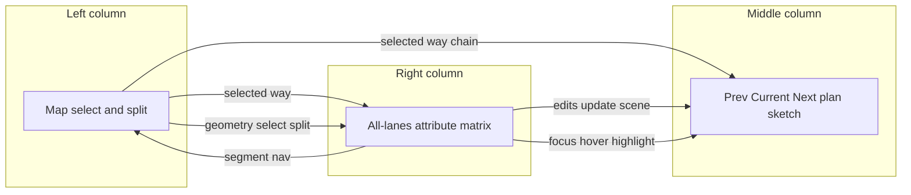
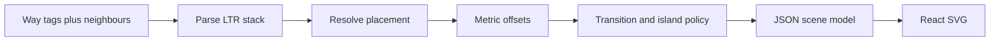
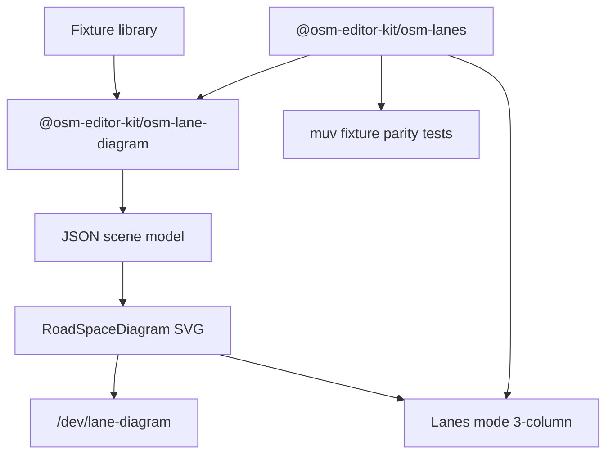

# Lanes Mode: Three-Column Redesign

## Goals

1. **Rework Lanes mode now** into a three-column editor: map selects/splits; middle is a Level-B plan sketch; right is an **all-lanes attribute matrix** with cell flyouts (not osm_viewer’s single-lane inspector). Form focus highlights the matching lane in the middle.
2. **Ship `@osm-editor-kit/osm-lane-diagram`** — a reusable short-segment **plan-sketch** layout engine aligned with [research/lane-rendering](research/lane-rendering/README.md) (parse → placement → metric offset → transition/island policy → style).
3. **Build a first-class test-case library + gallery** for curated street situations (transitions, bike, junctions, `dual_carriageway`, sidewalks) with serializable scene models for review and unit tests.
4. **Stay embedded in the existing stack**: `@osm-editor-kit/osm-lanes` remains the interactive parse/serialize source of truth; muv-osm fixtures as parity gold standard; SRK-shaped geometry fixes locally — not osm2streets network rewrites in the panel.

## Research grounding

Primary: [research/lane-rendering/00-research-question.md](research/lane-rendering/00-research-question.md) + [methods-catalogue.md](research/lane-rendering/methods-catalogue.md). Tags/projects: [research/lane-editor-tags/](research/lane-editor-tags/).

**Abstraction target = Level B (semantic lane stack)** — coloured/access slots, turn arrows, bike separation, metric widths. Not Imagico/Map Machine equal-tick casement alone (A), not Seidel architecture-plan + kerbs/ALKIS (C), not AV HD lane graphs (D).

**Panel presentation choice (from catalogue §7, adapted):** SVG for the short-segment **plan sketch**; edits live in a **matrix form + flyouts**, not HTML chips and not osm_viewer’s click-lane → single-lane panel. Middle accepts highlight from form focus only. Old `LaneCrossSection` chips go away with the bottom panel.

**Ecosystem decisions we adopt:**

| Decision | Choice | Why |
| --- | --- | --- |
| Parse / tags round-trip | Keep TS [`@osm-editor-kit/osm-lanes`](packages/osm-lanes/) | Editor source of truth; already wired |
| Parse gold standard | muv-osm / osm2streets `get_lane_specs_ltr` via **fixtures + parity tests** | Active shared semantics; catalogue §7.3 |
| osm2streets-js full network/WASM in panel | **No** | Heavy graph/transforms; wrong UX for editing one way |
| Dual-carriageway / island | **SRK spreading** (preserve topology) | Local, tag-driven; A/B Street consolidation rewrites graph |
| Complex junctions | Butt-end / soft break; optional cut-out later | SRK: turn connectivity through junctions still unsolved |
| Draw language | TypeScript → JSON scene → React SVG | One segment is ms-work; WASM buys fidelity not FPS |
| Width defaults | SRK Berlin-ish: car **3.0 m**, cycle **1.5 m**, parking **2.2 m**, sidewalk ~**2 m** | Prefer tagged `width` / `width:lanes` over defaults |

---

## Target design



| Column | Job | Interaction |
| --- | --- | --- |
| **Left — Map** | Select way; later split. Not a lane diagram. | Click way / split; camera reframes |
| **Middle — Diagram** | Level-B plan sketch of prev / current / next; continuous edges; metric widths | **No click-to-edit**; **highlight** slot when form focuses/hovers that lane |
| **Right — Form** | All lanes at once (matrix); cell flyouts for per-lane values; segment nav | Edits update diagram; focus syncs highlight |

Production shell: replace [`LanesBottomPanel`](app/src/modes/lanes/LanesBottomPanel.tsx) / sidebar hide in [`MapPage`](app/src/shell/map/MapPage.tsx) with this three-column layout when mode is `lanes` and a way is selected.

### Form UX vs A/B Street osm_viewer

[AB Street osm_viewer](https://play.abstreet.org/0.3.49/osm_viewer.html) (muv/osm2streets under the hood; note in [abstreet-osm-viewer.md](research/lane-editor-tags/projects/abstreet-osm-viewer.md)) lets you **hover/click each lane** (incl. sidewalks) and shows a **single-lane inspector** on the right. Useful for QA of interpreted geometry — not our edit model.

**We keep from that UX:** clear visual coupling between a lane in the plan sketch and the attribute being edited (highlight the matching slot in the middle while working on the right).

**We diverge:** the right column shows **all lanes of the focused segment at once**, as an attribute matrix (columns = LTR slots including sidewalks; rows = attributes). Per-lane decisions open in **flyouts** (or equivalent popovers), not by narrowing the whole panel to one lane.

Sketch:

```text
              | sidewalk L | bike | lane1 | lane2 | lane3 | sidewalk R |
turn          |     —      |  —   |  ↑    | ↑→    |  →    |     —      |
surface       | asphalt    | …    | …     | …     | …     | asphalt    |
smoothness    | good       | …    | …     | …     | …     | good       |
width (m)     | 2.0        | 1.5  | 3.0   | 3.0   | 3.0   | 2.0        |
vehicle       |     —      | no   | yes   | yes   | yes   |     —      |
bicycle       |     —      | des. | yes   | yes   | yes   |     —      |
```

Click a cell (e.g. `surface` for lane2) → flyout editor → commit updates tags/model → diagram re-layouts; while the flyout/cell is active, middle **highlights that slot** (and optionally dims others). Way-level fields (`oneway`, `placement`, `lanes` counts, `dual_carriageway`, sidewalk presence) sit above/beside the matrix, not as per-lane cells.

### Middle column — short-segment plan sketch (SVG)

Implements the shared pipeline from [methods-catalogue §1–2](research/lane-rendering/methods-catalogue.md):



1. **Parse LTR stack** — motor slots from `lanes*` / pipes; **expand** on-carriageway bike via `cycleway:*=lane` / `cycleway:lanes` (bike **not** in `lanes=*`; bus **is**). Sidewalks as edge slots from `sidewalk=*` (tag-only offsets; no Sidewalkreator / zip-sidepaths in v1).
2. **Resolve placement** — `left_of:N` / `right_of:N` / `middle_of:N` / `transition`; SRK defaults if missing (odd → `middle_of:(lanes/2)`, even → `left_of:(lanes/2+1)`). Anchor shifts the stack relative to the way centreline marker.
3. **Metric thicken/offset** — sum widths from placement anchor; scale with fixed m→px; prefer `width:lanes` then defaults. Emit fills + separators (not equal Imagico ticks when per-lane widths exist).
4. **Transitions** — with prev/next, continuous outer edges and trapezoid/lerp blends on width changes (`placement=transition`); without neighbours, **butt-end** segment caps (catalogue gap #5 — explicit policy).
5. **Islands** — when `dual_carriageway=yes` meets a non-dual same-name neighbour: **spread** so markings run past the median (SRK); show two carriageway groups with a gap. Do **not** run A/B Street `MergeDualCarriageways`.
6. **Junctions** — T/cross: soft break / butt ends; dim stubs if present. No full turn-lane connectivity through the junction. No `area:highway` cut-out required for v1 panel (map already shows topology).
7. **Style** — turn glyphs from `turn:lanes`; solid/dashed from `change:lanes` / `lane_markings`; bike colour / restrict styling for designated slots.
8. **Highlight prop** — scene slots accept `highlightedSlotId` from form focus/hover (visual only; no hit-testing for edit).

**Continuity across three segments** is the product differentiator vs single-strip OLV HTML: shared metre scale, continuous kerb/separator polylines, fork branches that stay visually aligned.

References: Seidel/SRK offset practice, Map Machine placement, OLV chain walk, Streetmix/bhousel SVG mockups — [lane-editor-tags/projects](research/lane-editor-tags/projects/). Highlight coupling inspired by osm_viewer lane hover, without adopting its single-lane inspector.

### Left map camera

On segment change, animate MapLibre `easeTo` for a **straight vertical corridor** in the left panel:

- **Bearing** from dominant way direction ([`way-side-order.ts`](app/src/modes/parking/domain/way-side-order.ts) / [`screen-ordered-neighbors.ts`](app/src/modes/lanes/domain/screen-ordered-neighbors.ts)); prefer north-up when flips are equal.
- **Pitch** ~40–55° corridor tilt; recompute on focus change.
- Replace bounds-only fly-to in [`use-lanes-fly-to-way.ts`](app/src/modes/lanes/use-lanes-fly-to-way.ts) for this mode; enable pitch in the lanes map surface (today [`MapPage`](app/src/shell/map/MapPage.tsx) has `pitchWithRotate={false}`).

### Right form — all-lanes matrix + flyouts

Bound to `@osm-editor-kit/osm-lanes` (+ edge tags). **Not** a single-lane inspector (osm_viewer pattern).

**Layout:**

- **Way-level block:** `oneway`, `lanes` / directional counts, `placement`, `lane_markings`, `dual_carriageway`, sidewalk/cycleway presence toggles that add/remove edge columns.
- **Lane matrix:** one column per LTR slot (sidewalks included); rows = per-lane attributes. Cell shows current value; click opens a **flyout** to edit that cell.
- **Segment nav** in the form (prev/current/next), not via middle clicks.

**Matrix rows (v1 must / should)** from [consolidated-tag-reference](research/lane-editor-tags/tags/consolidated-tag-reference.md):

- Turns: `turn:lanes` (+ directional)
- Access: `vehicle:lanes`, `bicycle:lanes`, `access:lanes` (+ bus as should)
- Geometry: `width:lanes` (and surface/smoothness rows when we expose them — same cell/flyout pattern)
- Kind/role inferred for display (travel / bike / bus / sidewalk / both_ways)

**Focus sync:** hovering or focusing a matrix column/cell sets `highlightedSlotId` on the middle diagram so the edited lane is obvious. Closing the flyout clears or keeps last highlight per UX polish.

**Interaction rule:** middle never opens editors; map owns spatial geometry; form owns all attribute edits (matrix + flyouts).

---

## Architecture



### Package: `@osm-editor-kit/osm-lane-diagram`

Layout/draw only — no OSM fetch/upload. Pure functions; scene JSON serializable for gallery snapshots and tests ([catalogue §7.5](research/lane-rendering/methods-catalogue.md)).

| Module | Responsibility |
| --- | --- |
| `types.ts` | Slots (kind, widthM, direction, turn, markings), segments, chain, optional fork children |
| `defaults.ts` | SRK-shaped metres per kind |
| `from-lane-model.ts` | `WayLaneModel` + sidewalk/cycleway expand + placement → stack |
| `placement.ts` | Absolute placement index / defaults / transition anchors |
| `layout.ts` | Offsets → scene (rects, continuous polylines, forks, shared scale) |
| `react/RoadSpaceDiagram.tsx` | Display-only SVG from scene; `highlightedSlotId` styling |
| Unit tests | Continuity, width sums, placement defaults, fork coords, fixture scene snapshots |

### Test-case library + gallery

- Typed fixtures (id, title, description, per-segment tags, optional fork topology) — package or `app/src/modes/lanes/test-cases/`.
- Gallery [`app/src/routes/dev.lane-diagram.tsx`](app/src/routes/dev.lane-diagram.tsx): tags + live diagram; one sandbox with poke form.
- Seed from curated list below; adopt useful cases from [lane-editor-tags/test-cases](research/lane-editor-tags/test-cases/) (muv-osm / osm2lanes) for **parse parity**, not a full muv dump in the gallery.

### Lanes mode rework

- Left: existing lanes map layers/selection + corridor camera
- Middle: display-only `RoadSpaceDiagram` via [`use-lanes-chain`](app/src/modes/lanes/domain/use-lanes-chain.ts), highlight from form focus
- Right: all-lanes matrix + flyouts + segment nav (replace [`LanesSlotEditor`](app/src/modes/lanes/components/LanesSlotEditor.tsx) single-slot free-text)
- Stop mounting `LanesBottomPanel` as primary editor

---

## Fixture scenarios (test library)

Every scenario includes **left/right sidewalk** edge slots.

1. **One-lane each way** — three collinear segments, `lanes=2` / 1+1.
2. **Two-lane each way + centre line** — `lanes=4`, markings yes.
3. **Right turn pocket** — last segment gains `turn:…|right`.
4. **Turn pocket then continue** — 4 lanes then next drops back to 2.
5. **Dual carriageway island** — `dual_carriageway=yes` spread / fork + median gap.
6. **T-junction** — chain ends or angled stub; butt-end break.
7. **Cross junction** — best-angle continue ([`osm-way-chain`](packages/osm-way-chain/)); stubs dimmed.
8. **Turning / mid-road bike** — `cycleway:lanes` + `placement` + `width:lanes` (SRK mid-road case).
9. **Oneway + sidewalks + bike** — asymmetric L→R.
10. **Placement transition** — `placement=transition` + start/end between unequal stacks.

---

## Implementation steps

Follow [methods-catalogue §6](research/lane-rendering/methods-catalogue.md) build order, adapted to three-column UI:

1. Scaffold `packages/osm-lane-diagram` + app workspace wiring.
2. Parse LTR + defaults → single-segment scene → SVG.
3. Placement (incl. defaults) → offsets → carriageway fill + separators + turn glyphs.
4. Expand on-carriageway bike + sidewalk edge strips; support `highlightedSlotId`.
5. Prev/next chain: shared scale, continuous edges, transition lerp.
6. Dual-carriageway spreading / fork layout.
7. Junction fixtures: butt-end policy (no connectivity solver).
8. Fixture library + gallery + scene snapshot tests; muv parity hooks on `osm-lanes`.
9. Build all-lanes matrix form + cell flyouts; wire focus → diagram highlight.
10. Rework lanes mode to Map | Diagram | Form; corridor camera; live chain/edits.
11. Cross-link product decisions in [research/lane-rendering](research/lane-rendering/README.md) (matrix+flyout vs osm_viewer single-lane inspector; SVG vs §7.2 chips).

## Out of scope

- Way splitting UX on the map
- osm2streets-js / WASM network render or dual-cw **consolidation**
- Full junction turn-lane connectivity / `area:highway` micromap cut-outs in the panel
- Architecture-plan extras (kerbs, ALKIS fills, crossing zebras in the diagram)
- Parking slots in the middle column (sibling parking mode)
- Live PNG/Canvas edit path; map overlay lane polygons
- Preserving old chip bottom-panel as parallel UI

## Success criteria

- Lanes mode ships the three-column layout as primary UX.
- Gallery covers curated scenarios with continuous edges, coherent metric widths, and intentional dual-cw / turn-pocket behaviour.
- Form matrix shows all lanes; flyouts edit cells; middle never opens editors but highlights the focused/hovered lane.
- Scene model is serializable and covered by package tests; parse parity hooks exist for muv-overlapping fixtures.
- Map camera animates bearing + pitch on segment change.
- Package has no app-shell dependency.
