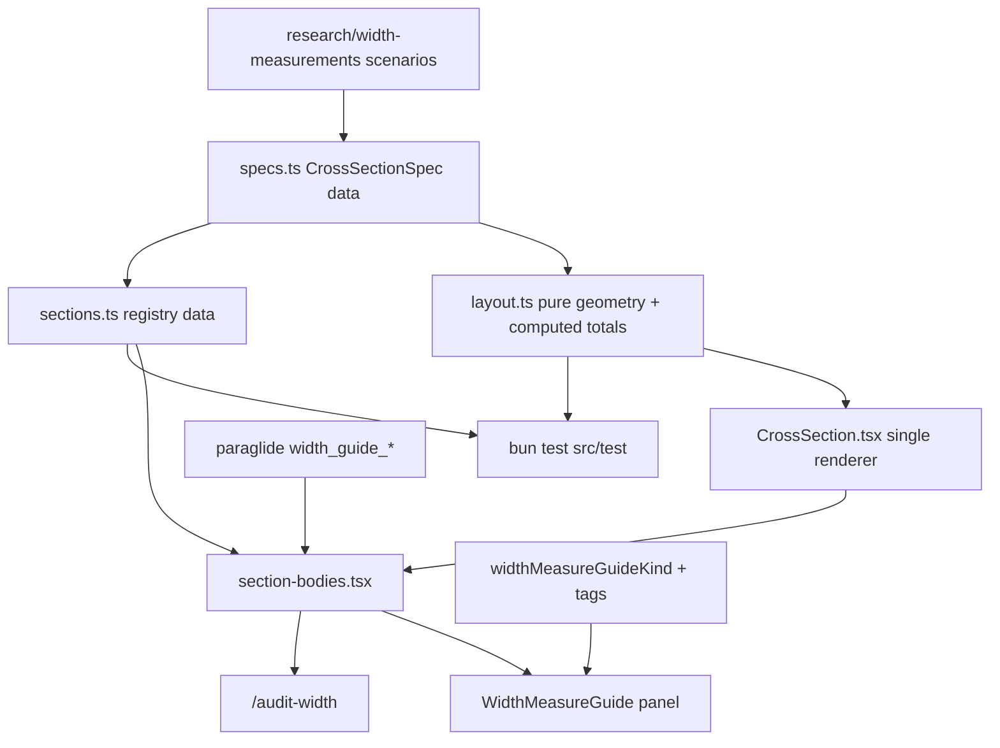

# Width measure docs + panel reuse

## Audit of yesterday’s panel guide

Current UI: [`WidthMeasureGuide.tsx`](app/src/modes/width/controls/WidthMeasureGuide.tsx) + [`width-measure-guide-kind.ts`](app/src/modes/width/domain/width-measure-guide-kind.ts) + paraglide keys `width_guide_*` + PNG assets via [`width-graphics.ts`](app/src/modes/width/domain/width-graphics.ts).

| Area | Status today | Gap |
|------|--------------|-----|
| Road `width=*` kerb→kerb | Covered (text + wiki PNG) | SVG in the panel; PNG stays on the audit page as the cited source |
| Parking lane vs street_side | Covered (two wiki PNGs) | Keep; redraw as SVG with explicit measure arrows |
| `width:lanes` | **Missing** | Need clear “inner / between markings” + relation to `width=*` |
| Lane markings in the sum | **Missing** | Research §2.2 assumption not in panel |
| Buffer includes paint | Covered (ERA PNG) | SVG relation diagram in the panel; ERA drawing stays beside it on the audit page as evidence |
| Cycle clear width | Text only | Needs SVG |
| `cycleway:width` + `footway:width` + marking vs path `width` | **Missing** | Segregated-path case |
| Verge / grass (`verge:*:width`) | Contradictory: panel says *ignore* short verges; research documents `verge:*:width` | Dedicated section; fix sidewalk copy |
| `maxwidth` / `maxwidth:physical` vs `width` | **Missing** | Research §2.5 + §8 lists “distinguish the three in UI copy” as a **must** |
| `est_width` / `source:width` | **Missing** in copy, though the app already writes `source:width` for aerial estimates | Provenance section (research §2.3) |
| Narrowings (split way, `narrow=yes`, `hazard=road_narrows`) | One sentence buried in sidewalk/other copy | Own section (research §3.6) |
| `shoulder=*` / `shoulder:*:width` | **Missing** | Mention inside `road-kerb` (research §2.6: situational, often outside) |
| Full ROW has no aggregate tag | **Missing** | Audit-only section (research §3.4) |
| Guide kinds | `road` \| `sidewalk` \| `cycleway` \| `other` | Too coarse for docs gallery; registry of **sections**, panel picks a subset |

Research source of truth: [`research/width-measurements/README.md`](research/width-measurements/README.md).

**Binding rule (new):** every section declares a `research` anchor (e.g. `§3.3 Scenario B`) that the audit page renders as a link, and every numeric diagram is generated from a spec whose band metres come from a research scenario. Prose and drawings cannot silently drift from the research package.

**Honesty rule (new):** the “`width:lanes` excludes paint” rule is a **logical assumption** (research §2.2, listed as open question §7.1), not wiki text. Diagrams and copy that rely on it must label it as an assumption. The same applies to marking thickness on a segregated path — research establishes no rule there, so `path-segregated` must not assert one.

## Shared audit route naming (width + lanes)

Both pages share one goal: **review how the app understands OSM data** (tags → interpretation → visuals), not a random “dev gallery”.

**Chosen scheme (flat, no `/dev` prefix):**

| Page | Route | File route | Page title (EN) |
|------|-------|------------|-----------------|
| Width | `/audit-width` | `audit-width.tsx` | Width — measure rules and tag relations |
| Lanes | `/audit-lanes` | `audit-lanes.tsx` | Lanes — cross-section interpretation |

**Why not `/dev/…`?** That prefix only meant “internal tooling, hide from users.” These pages are deliberate audit entry points linked from the README — not debug consoles. `/dev` adds length and implies a `/dev` index that we are not building. Static routes (`audit-width`, `audit-lanes`) sit beside `/$mode` and take precedence over the mode catch-all (unknown `/$mode` would otherwise fall back to parking).

Discovery is the **README** (and cross-links in each page header). No nested index.

Replaces earlier drafts `/dev/width-measure`, `/dev/lane-diagram`, `/dev/audit/width`, `/dev/audit-width`.

Why this naming:

- **Flat** `/audit-*` — same family without hollow nesting
- **`audit-`** signals the job; **`width` / `lanes`** are the mode subjects
- Distinct from mode URLs `/width`, `/lanes` (map editors)

Rejected: `/dev/*` (unnecessary namespace), `/dev/audit/width` (hollow index), `/gallery/*`, `/docs/*`.

### Discovery: README links (audit setup)

Entry point is **not** mode chrome — it is the **repo README**.

Add an **Audit** subsection under [README.md](README.md) **Development** (after `bun run dev`):

```md
### Audit — how the app understands OSM data

Pages to review measure rules, diagrams, and tag interpretation (English, no mode nav).
App base path is `/street-space-editor/` (same in local Vite and GH Pages).

With `bun run dev` running:

- [Width audit](http://localhost:5173/street-space-editor/audit-width)
- [Lanes audit](http://localhost:5173/street-space-editor/audit-lanes) (when shipped)

Deployed:

- https://osmberlin.github.io/street-space-editor/audit-width
- https://osmberlin.github.io/street-space-editor/audit-lanes
```

Also cross-link from [`research/README.md`](research/README.md) and [`research/width-measurements/README.md`](research/width-measurements/README.md) to `/audit-width`.

Each audit page header links to its sibling (`audit-width` ↔ `audit-lanes`).

### Alignment conventions

| Convention | Lanes (`/audit-lanes`) | Width (`/audit-width`) |
|------------|------------------------|------------------------|
| Audience | Audit, English | Same |
| Layout | Fixture list + live diagram + sandbox | **Section TOC + all sections**: SVG, paraglide copy, research anchor link, `editorWrites` note, source-image comparison where one exists; optional tag sandbox later |
| Locale | English fixtures | **Locale toggle** (`useUiLocale`) so DE and EN copy are both auditable |
| Discovery | README + sibling header link | Same |
| In-app mode chrome | **No** | Same; width panel still uses shared sections |

Do **not** wait on `@osm-editor-kit/osm-lane-diagram`. These are **teaching cross-section SVGs** (measure arrows, paint strokes, kerbs), generated in the app from a local spec — not the plan-sketch layout engine. Same architecture pattern as the sibling page (data → pure layout → SVG, asserted by tests), different vocabulary.

## Architecture



New folder: [`app/src/modes/width/measure-guide/`](app/src/modes/width/measure-guide/)

- `cross-section/types.ts` — `CrossSectionSpec` (bands, kerbs, dimensions)
- `cross-section/layout.ts` — **pure**, no React: spec → rects, arrows, computed totals
- `cross-section/CrossSection.tsx` — one dumb renderer for every diagram
- `specs.ts` — the diagram data (one spec per situation, metres from research scenarios)
- `sections.ts` — registry as **plain data**: `{ id, group, research, spec, messages, panelKinds, showWhen?, audience, editorWrites }`
- `section-bodies.tsx` — id → body component map (kept out of `sections.ts` so tests can import the data without React)
- Panel entry filters the registry by kind/tags
- `WidthAuditPage.tsx` — full-page audit layout
- Route: `audit-width.tsx` (TanStack file route; static, so it outranks `/$mode`, whose `params.parse` would otherwise coerce `audit-width` to `parking`; `routeTree.gen.ts` regenerates via the Vite plugin)

**i18n — one source of copy, not two.**

The previous draft had panel copy in paraglide and audit copy hardcoded as `titleEn` / `blurbEn`. That defeats the page: it would audit strings no user ever sees, and the two copies drift on the first edit.

- **All copy is paraglide** (`width_guide_*`), panel and audit page alike.
- The audit page gets a **locale toggle** using the existing [`useUiLocale`](app/src/i18n/useUiLocale.ts) (`setLocale(locale, { reload: false })`), so DE copy — currently unreviewable anywhere — becomes auditable too.
- **SVGs stay language-light**: metres, OSM keys, arrows only. No sentences inside `<svg>`; prose lives in HTML next to it. This is what lets one diagram serve both the 272 px panel and the wide audit page.

## Section catalogue (audit page shows all; panel shows a filtered subset)

Each entry: id — content — `research` anchor — `editorWrites` (what the width mode can actually tag; the rest is documentation-only and must say so).

**Carriageway**

1. **`road-kerb`** — `width=*` kerb→kerb; includes on-street parking + on-carriageway cycle; excludes sidewalks / separate tracks / `street_side` parking; note `shoulder=*` as situational. §2.1/§2.6 — writes `width`.
2. **`road-parking-branch`** — `parking:*=lane` **inside** vs `street_side` **outside**; baseline when the kerb steps in/out. §2.6 — documentation-only (parking tags belong to the parking mode).
3. **`road-width-lanes`** — `width:lanes` = **clear width between markings** (assumption), pipe slots, ≠ `lanes=*`. §2.2 — documentation-only today.
4. **`road-width-vs-lanes`** — reconciliation: `width ≈ Σ width:lanes + Σ paint (+ parking / shoulder / buffer / gutter)`; DE strokes 0.12 / 0.25 m. §2.2 + §3.1/§3.2 — documentation-only.

**Cycle**

5. **`cycleway-clear`** — `cycleway:*:width` / separate cycleway `width=*` measured between boundary lines. §2.7 — writes `cycleway:SIDE:width` via `nestSideTags`.
6. **`cycleway-buffer`** — buffer metres **include** paint/hatch; relation to cycle clear width. §2.8 — documentation-only.

**Sidepaths and pedestrian space**

7. **`path-segregated`** — path `width=*` vs `cycleway:width` + `footway:width`; marking thickness is an **open question**, not a rule. §2.7 + §7.1 — documentation-only.
8. **`sidewalk`** — typical usable width, not the pinch point. §2.6 — writes `sidewalk:SIDE:width`.
9. **`verge`** — `verge=*` / `verge:*:width` sit **outside** carriageway `width=*`. Replace the “ignore verge nudges” wording: ignore only tiny indentations for *sidewalk* width; a real grass strip gets its own verge width. §2.6 — documentation-only.
10. **`other-path`** — generic usable surface width. §2.1 — writes `width`.

**Values and provenance (new — required by research §8 “Must”)**

11. **`maxwidth-vs-width`** — `width` (feature) vs `maxwidth` (legal, signed) vs `maxwidth:physical` (clearance). §2.5 — documentation-only. Research §8 lists this as a *must* for UI copy.
12. **`est-width-provenance`** — `est_width` for estimates, `source:width` for method (the app already writes `source:width` on aerial estimates, so this documents live behaviour). §2.3 — writes `source:width`.
13. **`narrowings`** — split the way, tag local `width`, optional `narrow=yes` / `hazard=road_narrows`; routers prefer the minimum, not an average. §3.6 — writes `width` on the split segment.
14. **`row-composition`** — there is **no** aggregate ROW tag; sum `sidewalk:*:width` + `verge:*:width` + `width=*` (+ areas). §3.4 — audit page only.

Also worth a single "don't" line inside section 4: `width:effective` exists but its measurement boundary is undefined (§2.4) — prefer `width` + parking scheme or `width:lanes`.

Panel mapping (`audience: 'panel+audit'` unless noted):

- `road` → 1–4, plus 11 and 13 collapsed
- `cycleway` → 5–6, plus 7 when `segregated=yes` or foot+cycle width tags are present
- `sidewalk` → 8–9, plus 13 collapsed
- `other` → 10, plus 13 collapsed
- 12 collapsed in every kind; 14 is `audience: 'audit'`

**Panel density (fix):** four stacked sections in a ~272 px panel is a wall of text. Exactly one section is expanded — the most specific one whose tags are present — and the rest render as collapsed `<details>`. `showWhen` gates the noisy ones: section 4 only when `width:lanes` exists, section 2 only when `parking:*` tags exist, section 6 only when a buffer tag exists.

## SVG requirements — how they look and how they are generated

### Generate, don't hand-draw

The earlier draft was “one hand-written React SVG component per situation”. For an **audit** page that is the wrong default: if a diagram's `8.36` is typed by hand, the page reviews a drawing rather than the app's understanding — and the first draft of that very diagram was arithmetically wrong (see the corrected examples below).

**Approach: a tiny declarative spec + one renderer.** Geometry is derived from metres; every dimension label is a *computed sum*, never a literal.

```ts
type BandKind =
  | 'motor' | 'parking' | 'cycle' | 'foot' | 'buffer' | 'verge' | 'paint' | 'gutter' | 'outside'

type CrossSectionBand = { kind: BandKind; m: number; label?: string; hatch?: boolean }

type CrossSectionDimension = {
  from: number            // first band index, inclusive
  to: number              // last band index, inclusive
  key: string             // 'width=*' | 'width:lanes' | 'cycleway:right:buffer'
  side: 'above' | 'below'
  row?: number            // stacking row, so nested spans don't collide
  showSum?: boolean       // render '= 3.00 + 3.00 + 3x0.12' under the arrow
  assumption?: boolean    // dashed arrow + footnote marker (research §2.2)
}

type CrossSectionSpec = {
  id: string
  research: string        // '§3.2 Scenario A'
  bands: CrossSectionBand[]
  kerbAt?: number[]       // band boundary indices drawn as kerb
  dimensions: CrossSectionDimension[]
}
```

`layout.ts` turns a spec into rects and arrow coordinates by cumulative metres and returns each dimension's computed total. Nothing in the drawing can disagree with the data.

Why this beats ten bespoke components:

- **Auditable.** The number under the arrow is the sum of the bands the arrow spans. A wrong diagram becomes a failing test, not a typo nobody notices.
- **Consistent.** One scale, one arrow style, one palette across all fourteen sections, for free.
- **Testable in the existing setup.** `app/package.json` runs `bun test src/test`; there are no `.test.tsx` files and no jsdom/testing-library. A pure `layout.ts` is testable today; a React component is not.
- **Same shape as the sibling page.** `/audit-lanes` is scene-model → `sceneToSvg()` with snapshot tests. Same architecture pattern, different vocabulary (teaching dimensions vs plan sketch), which is why this still does **not** wait on `@osm-editor-kit/osm-lane-diagram`.
- Cheap to add a case later: a few lines of data.

Keep it local (`app/src/modes/width/measure-guide/cross-section/`). Extract to a package only if a second consumer appears.

### Visual language and concrete numbers

- **Scale 44 px/m.** An 8 m street is 352 px of content — comfortable on the audit page, and `width="100%"` on a fixed `viewBox` scales it into the ~272 px panel.
- **Paint is drawn true to scale.** At 44 px/m a 0.12 m Schmalstrich is 5.3 px and a 0.25 m Breitstrich is 11 px — both clearly visible. No exaggeration, which matters on a page whose subject is millimetres. (Floor the rendered stroke at 2 px for tiny values.)
- Band height 56, dimension rows 18 units each, font-size 13 in viewBox units (~10 px CSS at panel scale).
- `density: 'panel' | 'audit'` on the renderer: panel drops the `showSum` arithmetic row and secondary dimension rows; audit shows everything.
- Fills from one `BAND_STYLE` map (Tailwind zinc + existing mode accents); arrows and text use `currentColor`. Do not copy the flat greys of `app/src/assets/street_parking/*.svg` — those are icons, not measured drawings.
- Kerb = thick vertical rule; `outside` bands (sidewalk, separate track) render de-saturated so “not in `width=*`” reads at a glance.
- **a11y:** `role="img"` + `<title>` per diagram, and the metres repeated in the HTML caption so the numbers are not trapped in the SVG.

### Priority relation diagrams (corrected, numbers from research)

Each spec reuses a validated research scenario, so the diagram, the research README and the panel cannot drift.

#### 1. `road-width-vs-lanes` — research §3.2 Scenario A

The earlier draft of this diagram was wrong twice: `2.0 + 3.0 + 3.0 + 1.5 + 0.36` is **9.86**, not the stated `8.36`; and it put the cycle lane in `width:lanes=3|3|1.5` *and* drew it as its own band, which is exactly the double-counting research §3.3 warns against (“pick one modelling style per way”). Use the clean paint scenario instead — one teaching point per diagram:

```text
         ┊ = 0.12 m Schmalstrich   (assumption §2.2: not inside width:lanes)

║ · ┊ ███ 3.00 ███ ┊ ███ 3.00 ███ ┊ · ║
      ◄ width:lanes ►◄ width:lanes ►        (dashed = assumption)
            = 3|3, clear between markings

║◄──────────── width=* = 6.36 ────────────►║
      = 3.00 + 3.00 + 3 x 0.12   (+ gutter ·)
```

Matches research §3.2 exactly (`width ≈ 6.36`, not 6.0). The `width:lanes` arrows are dashed and footnoted because the clear-width reading is a logical assumption, not wiki text.

#### 2. `road-kerb` composition — research §3.3 Scenario B

```text
║ ▓▓ parking 2.0 ▓▓ │ ███ motor 3.0 ███ │ ░░ buffer 1.0 ░░ │ ▒▒ cycle 2.0 ▒▒ ║
  ◄ parking:right:width ►                 ◄ …:buffer:left ►◄ …:right:width ►
                       ◄──── width:lanes = 3|2 ────────────────────────────►
║◄─────────────────────── width=* = 8.0 ───────────────────────────────────►║
```

`2 + 3 + 1 + 2 = 8`. Note this scenario deliberately has **no** separate paint bands — the buffer absorbs its own paint (§2.8), which is the contrast with diagram 1. The bike band is spanned by both `width:lanes` and `cycleway:right:width`; the audit page prints the §3.3 double-counting warning right under it instead of hiding the overlap.

#### 3. `cycleway-buffer` zoom — research §2.8 (ERA)

```text
███ motor ≥3.00 ███ ┊ ░░ hatch ≥0.63 ░░ ┃ ▒▒ cycle ≥2.00 ▒▒
                   0.12                0.25
                    ◄─── cycleway:*:buffer ≥1.00 ───►◄─ cycleway:*:width ─►
                        0.12 + 0.63 + 0.25 = 1.00        (between lines only)
                        paint INCLUDED                    paint EXCLUDED
```

Sums to the drawing in research §2.8. Rendered beside the source image on the audit page (see provenance below).

#### 4. `path-segregated` — research §2.7

```text
║ ▒▒ bicycle 1.3 ▒▒ │ ■■ foot 2.2 ■■ ║
  ◄ cycleway:width ►◄ footway:width ►
║◄────── width=* = 3.5 ──────►║
```

`1.3 + 2.2 = 3.5`. Drop the earlier “(+ marking thickness if any)”: research establishes no marking rule for segregated paths, so the section states it as an open question (§7.1) rather than implying a formula.

### Provenance: keep the source images on the audit page

“Retire the PNGs” would strip evidence from the one page whose job is evidence. `era-buffer-includes-paint.png` **is** the proof for the paint-in-buffer rule, and `Width-carriageway.png` is CC BY-SA wiki material attributed in [`app/public/assets/width/wiki/README.md`](app/public/assets/width/wiki/README.md).

- **Panel:** our SVG only (smaller, sharper, localised).
- **Audit page:** our SVG **side by side** with the source image plus its citation, so a reviewer can check the simplification is faithful.
- Before touching [`width-graphics.ts`](app/src/modes/width/domain/width-graphics.ts), confirm the parking PNGs are shared with the parking mode (`street_parking/wiki/`) — the width helpers are wrappers, the assets are not ours to delete.

### Simpler single-concept SVGs

| Section | Sketch intent |
|---------|----------------|
| `road-kerb` | Full street: sidewalks greyed “outside”; carriageway highlighted with one `width=*` arrow kerb→kerb; small “not building-to-building” callout |
| `road-parking-branch` | **Two panels side by side:** left `parking=lane` bay inside the `width=*` span; right `street_side` bay outside the baseline kerb line |
| `road-width-lanes` | Two motor slots only + centre paint; arrows only on the clear 3.0\|3.0 bands (teaching “inner width” before the full reconciliation SVG) |
| `cycleway-clear` | Bike strip between two lines; arrow stops at **inner** paint edges |
| `sidewalk` | Sidewalk band with typical-width arrow; pinch point marked “do not use as sole width” |
| `verge` | `sidewalk` \| `verge:*:width` grass \| `║ carriageway width=*` — verge clearly **outside** the kerb arrow |
| `other-path` | Single band + one usable-surface arrow |
| `maxwidth-vs-width` | Same carriageway drawn three times: `width=*` on the surface, `maxwidth` as a signed vehicle envelope, `maxwidth:physical` as a gate/pier clearance |
| `narrowings` | Longitudinal (not cross-section) strip: one way split into three, middle segment carrying its own `width=*`; annotate “routers take the minimum” |
| `row-composition` | Widest diagram: sidewalk + verge + carriageway + verge + sidewalk, each with its own arrow, and a crossed-out arrow spanning everything labelled “no aggregate OSM key” |
| `est-width-provenance` | Reuse the `road-kerb` spec with a dashed arrow + `est_width` / `source:width` callout |

### Implementation note

One renderer (`CrossSection.tsx`) plus one spec per section in `specs.ts`. Fixed `viewBox`, `width="100%"`, no external image, no i18n inside the SVG. Panel and audit page embed the same component with different `density`. `row-composition` and `narrowings` are the two specs that may need a second layout mode (longitudinal); if that gets awkward, they stay illustration-free and text-only for v1 rather than becoming hand-drawn exceptions.

## Files to change

| File | Change |
|------|--------|
| New `app/src/modes/width/measure-guide/cross-section/**` | `types.ts`, pure `layout.ts`, `CrossSection.tsx` |
| New `app/src/modes/width/measure-guide/specs.ts` | Diagram data, metres sourced from research scenarios |
| New `app/src/modes/width/measure-guide/sections.ts` + `section-bodies.tsx` | Registry data (React-free) + id → body map |
| [`WidthMeasureGuide.tsx`](app/src/modes/width/controls/WidthMeasureGuide.tsx) | Thin wrapper: filter registry by kind/tags, expand one, collapse the rest |
| New `app/src/routes/audit-width.tsx` | Width audit page (TOC, locale toggle, source-image comparison, sibling link) |
| [`README.md`](README.md) | **Audit** subsection under Development with local + GH Pages links to `/audit-width` (+ lanes when shipped) |
| [`research/README.md`](research/README.md) / width research README | Link to live `/audit-width` |
| [`app/messages/en.json`](app/messages/en.json) / [`de.json`](app/messages/de.json) | Keys for all 14 sections; fix `width_guide_sidewalk_verge` wording |
| [`width-graphics.ts`](app/src/modes/width/domain/width-graphics.ts) | Keep helpers used by the audit page's source-image comparison; drop only genuinely unused ones |
| `app/src/test/width-cross-section.test.ts` (new) | Pure layout tests, see below |
| [`width-measure-guide-kind.test.ts`](app/src/test/width-measure-guide-kind.test.ts) | Extend for the new registry filtering |

### Tests (must fit `bun test src/test`, no DOM)

1. **Spec sums:** each spec's `width=*` dimension total equals the research figure (6.36 for §3.2, 8.0 for §3.3, 1.00 buffer for §2.8, 3.5 for §2.7). This is the guard that would have caught the `8.36` error.
2. **Layout invariants:** band offsets strictly increase; every dimension's `from`/`to` are valid indices; arrow x-extent matches the summed band metres × scale.
3. **Registry completeness:** ids unique; every section has a `research` anchor, a `spec` (or an explicit `spec: null` for text-only), `panelKinds`, and `editorWrites`; every `panelKinds` value is a real `WidthMeasureGuideKind`.
4. **Message coverage:** every registry `messages` key exists in `en.json` and `de.json`.

No `.test.tsx` — the app has none and no jsdom/testing-library. SVG string snapshots stay out of v1; the layout assertions cover the risk.

### Deployment note

The deployed audit links work because [`deploy-pages.yml`](.github/workflows/deploy-pages.yml) copies `index.html` to `404.html` (SPA fallback on GH Pages). Anyone “cleaning up” that line breaks every deep link, including `/audit-width`.

## Out of scope

- Building `osm-lane-diagram` / map plan-sketch
- Editing `width:lanes`, `parking:*:width`, `verge:*:width`, `maxwidth*` in the width panel — several sections document tags this editor cannot write, which is why every section carries `editorWrites` and says so rather than implying capability
- Deleting the wiki/ERA source images (they stay as audit-page provenance)
- Extracting the cross-section engine into a package (local until a second consumer exists)
- SVG string snapshot tests, and any `.test.tsx` / jsdom setup
- `/dev` namespace, nested audit index, or in-app mode chrome links (README + sibling header links are the entry)
- Committing unrelated research markdown changes beyond audit deep-links
