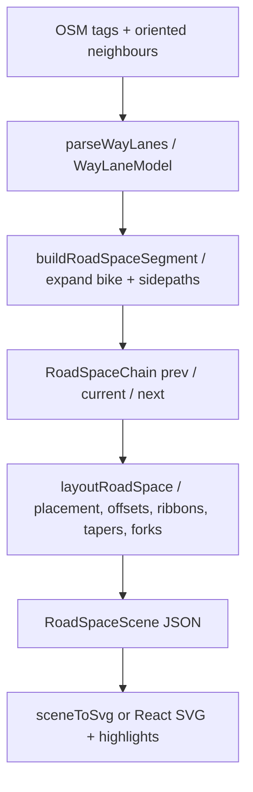

# Lanes and road-space: how we think about it

A conceptual guide for fellow developers. This explains **what we do and why** when turning OSM centreline tags into the lane plan sketch — not formulas, not a code walkthrough.

**Related research:** [lane-rendering methods catalogue](../research/lane-rendering/methods-catalogue.md) (algorithms and alternatives), [width measurements](../research/width-measurements/README.md) (metre semantics). **Living output:** [`/audit-lanes/$demoId`](../app/src/routes/audit-lanes/$demoId.tsx) gallery and package fixtures.

---

## 1. The problem

An OSM `highway=*` way is a **centreline**: one polyline that implicitly describes a whole cross-section — car lanes, bike lanes, sidewalks, placement of that centreline in the stack, widths, markings, and how it meets neighbours.

Editors and QA need a **short-segment preview** that is:

- faithful enough to catch tagging mistakes,
- editable through structured forms (not by clicking the drawing),
- fast enough to update on every tag keystroke.

We are not building city-scale map lane polygons or a full street network model. We are building a **corridor sketch** for the selected way (and optionally its immediate neighbours).

---

## 2. Product split: three jobs

The app separates concerns that are often conflated:

| Surface | Job | Question it answers |
|---------|-----|---------------------|
| **Map** | Geographic context | Where is this way? What is around it? |
| **Plan sketch (SVG)** | Abstract cross-section + short corridor | Does this tagging produce a plausible road-space layout? |
| **Matrix form** | Structured edit + validation | What are the lane tags, and are they internally consistent? |

The sketch is **read-only for editing** — selection/highlight yes, tag mutation no. The matrix is the edit surface.

> **Note:** Table-mode / neighbour-tag matrix experiments live elsewhere in the repo; they are not part of this pipeline doc.

---

## 3. Two models (on purpose)

We maintain **two related but distinct** representations:

### Carriageway slot model (`@osm-editor-kit/osm-lanes`)

- Parses OSM tags into a **WayLaneModel**: ordered carriageway lanes left→right, with direction, access, turn hints, widths, and **provenance** (tagged / inferred / default).
- Round-trips: parse → edit in form → serialize back to tags.
- Scope: what is *in* `lanes=`, `turn:lanes`, `width:lanes`, placement, on-carriageway cycle lanes, etc.

### Extended road-space stack (`@osm-editor-kit/osm-lane-diagram`)

- Takes the slot model and **expands** it into a wider stack: sidewalks, separate-cycleway hints, kerb-adjacent bands, dual-carriageway siblings.
- Produces metric layout → a JSON **scene** → SVG (string builder or React consumer).
- Scope: what the **sketch** should show beyond raw carriageway slots.

**Why two?** Carriageway editing must stay tag-faithful and reversible. The sketch needs sidepaths and corridor continuity that OSM often models on adjacent ways or only as existence hints — without inventing geometry the mapper did not imply.

---

## 4. Slots and provenance

Each lane slot carries **how we know** its properties:

| Provenance | Meaning |
|------------|---------|
| **tagged** | Explicit OSM key (e.g. `width:lanes`, `turn:lanes:forward`) |
| **inferred** | Derived from related tags (e.g. bus lane from `bus:lanes`, cycle lane expanded from `cycleway:right=lane`) |
| **default** | Filled when tags are silent (default car width, default placement rule, assumed driving side) |

Incomplete tagging is normal. The UI should surface **soft warnings** (width sum vs `width`, placement inconsistency, double-modelled bike) rather than silently “fixing” data. Defaults are visible in provenance so editors know what is real OSM truth vs our assumption.

**`cycleway:lanes` in the matrix:** intentionally limited / largely read-only for now — a product stance, not a finished API. On-carriageway `cycleway:*=lane` expansion in the sketch is the supported path today.

---

## 5. Pipeline (in spirit)

**Packages (names only):**

1. **`osm-lanes`** — tags ↔ carriageway slots, validation, width reconciliation.
2. **`osm-lane-diagram`** — segment → chain → layout → scene → SVG.

**Neighbour context:** prev/current/next stubs let us taper placement, hint dual-carriageway forks, and soften transitions. We do not rewrite the OSM graph.

**Gold standard for parity thinking:** [muv](https://github.com/a-b-street/muv-osm) / osm2lanes semantics — used in **fixtures and comparison tests**, not as a runtime dependency. We do not claim live parity on every edge case.

---

## 6. Placement and continuity

**Placement** (`placement`, `placement:forward`, start/end variants) answers: where does the way’s centreline sit in the left→right stack? It drives metric offsets for every band.

**Continuity across a short corridor:**

- Segments share a **logical centreline** along the sketch; left→right order is stable.
- **Tapers** blend placement/width when prev/next segments are provided (turn pockets, lane-count changes).
- **Implied junctions:** when a pure-turn pocket (left/right only — not `through;right`) disappears in its travel direction at a seam, the morphing transition is replaced by a fixed-height full-width cross-street placeholder band. Stacks end square; kerbs and the carriageway plate break instead of crossing. Pockets that *appear* downstream still taper.
- **Square steps** remain where we lack neighbour data — better than faking smooth geometry.
- **Continuous ribbons** (current era) replace older per-band rectangles: one filled corridor per lane/sidepath with shared kerb lines, so the sketch reads as a road rather than a stack of boxes.

**`placement=transition`:** known limitation. Without full neighbour lerp we fall back to a default anchor and surface a warning. Full transition modelling is future work.

**Placement inconsistency** (e.g. centreline index disagrees with summed widths) may **shear** the stack with a warning rather than hard-failing — the editor still needs to show something inspectable.

---

## 7. Bike, sidewalks, separate / absent

### On-carriageway bike

`cycleway:left/right/both=lane` (and related) **expands into the stack** beside car lanes — they are not assumed to already be counted in `lanes=` unless tagged that way.

### Separate cycleways / sidewalks (tag vs geometry)

Two different “separate” situations:

| Situation | Sketch behaviour |
|-----------|------------------|
| `cycleway:*=separate` / `sidewalk=separate` (or `use_sidepath`) on the main way | **Text hint only** under the sketch — **no metre bands**. Optionally jump to a nearby separately mapped way when the app finds one. |
| Parallel `highway=cycleway` / `highway=footway` + `footway=sidewalk` as its own OSM way | Hint / dashed sibling when linked; not invented metres on the main way’s stack. |

Double-modelling (side tags *and* a separate way) triggers a soft warning. We do **not** zip sidepaths onto the main carriageway the way osm2streets sometimes does.

### Sidewalks — strict existence rules

| Tag situation | Sketch behaviour |
|---------------|------------------|
| Untagged | **Absent** — we never invent sidewalks |
| `sidewalk=left/right/both` (on-way values) | Existence → kerb-adjacent **metre** band on that side |
| `sidewalk=none` / `no` | Explicitly absent |
| `sidewalk=separate` | Text hint only — see above |

We do **not** run osm2streets-style sidewalk inference as OSM truth.

### Bus / PSV

Bus lanes **count in `lanes=`** when tagged that way; side cycle lanes typically **do not** — parsers and the form must not conflate these conventions.

---

## 8. Dual carriageways and medians

OSM often splits one logical road into two one-way ways around a median. Naive per-way offsets **kink toward each centreline** and look wrong at the island.

Our approach (SRK-shaped, not A/B Street merge):

- When `dual_carriageway=yes` (or equivalent) and a tagged sibling neighbour exists, **spread locally** so markings run straight past the island.
- Preserve **OSM topology** — no graph rewrite, no consolidating intersections in the panel.
- Dual alone without a resolvable sibling → **placeholder sibling** band so the sketch still reads as split carriageway.
- **Bidirectional → dual** transitions: spread at the join; do not smear one carriageway across the median.

---

## 9. Orientation contract

Getting left/right and forward/backward wrong silently flips the whole sketch. We treat orientation as a **contract** across parse, layout, and UI:

1. **Way direction** is the arrow of travel for the edited way (OSM node order).
2. **Screen order** is left→right on the sketch.
3. **Neighbour tags** are flipped into the current way’s direction before parse.
4. **Forward travel on the diagram draws up the page** (toward the top of the SVG) — a true plan view. This matches width mode and map orientation; treat it as canonical.

**Driving side:** assume **right** (DE/EU) unless explicitly tagged. Country-from-map defaults are still TODO.

---

## 10. Widths

- **Clear slot metres** drive layout — the geometric width of each band in the stack.
- **Paint / marking millimetres** are cosmetic separator strokes; they are **not** added to slot widths in layout (see [width measurements](../research/width-measurements/README.md)).
- **Validation** uses soft sums: e.g. reconciling `width:lanes` against `width`, buffer tags in checks only.
- **Buffers** (`separation:left/right`, etc.): included in soft validation sums; **not drawn as their own bands** in the sketch today.
- **`width:lanes` longer than `lanes`:** extra entries are ignored or warned — lane count wins.
- **`lane_markings=no`:** prefer explicit widths over inventing separator gaps.

**Parking widths** feed soft checks in the parking form only. Parking is **never drawn** in the lane diagram; parking has its own editor mode.

---

## 11. Edge cases and tradeoffs (catalogue)

| Situation | What we do | What we did not choose |
|-----------|------------|------------------------|
| Sparse tags | Defaults + provenance; warnings | Silent “smart” completion |
| Reversed neighbour orientation | Flip tags into current way direction | Require mapper to fix neighbour first |
| Turn pocket / lane drop | Taper ribbons when next/prev available | Equal-space ticks per segment (Imagico-simple) |
| Missing placement | SRK-style default from lane count | Arbitrary centreline |
| Junction interiors | Butt-end or cut-out at segment end | Full turn-lane connectivity through junction |
| Clickable diagram edits | No — matrix only | Streetmix-style drag lanes |
| WASM muv at runtime | No — TS parse + fixture parity | Shared Rust binary in the browser |
| osm2streets network | No for panel | Full intersection polygons in-editor |
| Chip strip UI | Removed | HTML chip cross-section as primary edit |
| `*=separate` on main way | Text hint only, no metre bands | Draw invented sidepath metres |
| Separate footway/cycleway way | Hint / link, not merge | ZipSidepaths / graph merge |
| Incomplete dual tagging | Placeholder + warning | Heuristic dual merge |

---

## 12. What we deliberately don’t do

- **Junction turn connectivity** — no guaranteed arrow paths through complex intersections.
- **Map geo casement** — the sketch is schematic metres in a `viewBox`, not Web Mercator offset geometry.
- **Invent sidewalk existence** from highway class or inference config.
- **Parking columns** in the lane diagram.
- **WASM network render** (osm2streets-js lifecycle) in the edit panel.
- **Clickable diagram → tag edits** — selection/highlight only.
- **Live muv/osm2lanes** as the runtime parser (parity via tests/fixtures instead).

---

## 13. Evolution (how we got here)

1. **Research phase** — surveyed SRK, Map Machine, osm2streets, muv; captured methods in `research/lane-rendering/`.
2. **`osm-lanes` package** — typed parse/serialize/validate for carriageway slots.
3. **Chip strip era** — HTML `LaneSlotChip` cross-section for quick visual edit (removed).
4. **Three-column editor** — map | SVG plan sketch | matrix form; chips retired in favour of structured matrix + sketch.
5. **Dual / placement hardening** — SRK-style spreading, placement warnings, neighbour chain.
6. **Continuous corridor ribbons** — from band rectangles to shared-kerb ribbons, tapers, and dual forks when the graph allows.

The sketch still targets **abstraction level B** (semantic lane stack) from the research catalogue — not architecture-plan kerb furniture (C) or HD lane graphs (D).

---

## 14. Living examples

- **Fixture gallery:** `@osm-editor-kit/osm-lane-diagram/fixtures` — deterministic scenes for regression and design review.
- **App audit route:** `/audit-lanes/$demoId` — one fixture or sandbox per shareable URL (left nav + prev/next).
- **Parity fixtures:** compare TS parse output against muv/osm2lanes expectations where we have captured cases (not exhaustive).

When adding behaviour, prefer a **fixture + audit entry** over ad-hoc screenshots.

---

## 15. Glossary

| Term | Meaning |
|------|---------|
| **Centreline** | The OSM way polyline; placement locates it within the cross-section stack. |
| **Slot** | One band in the left→right stack (car lane, cycle lane, sidewalk hint, …). |
| **WayLaneModel** | Parsed carriageway slots + metadata from `osm-lanes`. |
| **Road-space segment** | Extended stack for one way after bike/sidepath expansion. |
| **RoadSpaceChain** | prev / current / next segments for corridor layout. |
| **Ribbon** | Continuous filled corridor geometry for a slot (vs old per-segment rectangles). |
| **Taper** | Blend between two segment layouts (placement/width change). |
| **Placement anchor** | The lane index or offset the centreline attaches to. |
| **Provenance** | tagged / inferred / default — source of a slot property. |
| **Scene** | JSON-serializable layout output (rects, polylines, metadata) before SVG. |
| **Clear width** | Metre width of the lane band; excludes paint-only separator stroke. |
| **Dual spread** | Local vertex/spacing adjustment so dual carriageways draw parallel past a median. |
| **Separate (cycleway/sidewalk)** | Either a main-way tag (`*=separate`) → text hint, no metres; or infrastructure on another way → hint/link, not merged topology. |

---

*Last updated: 2026-08. For implementation entry points see `packages/osm-lane-diagram/README.md` and `packages/osm-lanes` exports.*
