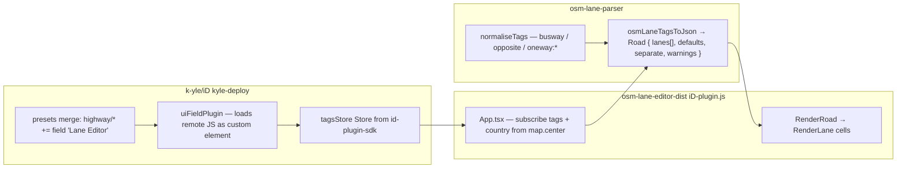

# Kyle Hensel — iD Lane Editor + osm-lane-parser

Working **sidebar cross-section** for highway ways in Kyle’s iD fork ([kyle.kiwi/iD](https://kyle.kiwi/iD)). Despite the name “Lane Editor”, the UI currently **visualises** tags only (no write-back). The hard parsing lives in a separate library. **Fetched 2026-08-06.**

| Field | Value |
|-------|-------|
| **Live demo** | https://kyle.kiwi/iD/#id=w1192548090 (example: Wellesley St West, Auckland) |
| **Standalone UI host** | https://kyle.kiwi/osm-lane-editor-dist/ |
| **iD fork** | https://github.com/k-yle/iD (`kyle-deploy` branch) |
| **Plugin bundle** | https://kyle.kiwi/osm-lane-editor-dist/dist/iD-plugin.js (+ `.map`) |
| **Parser (open source)** | https://github.com/k-yle/osm-lane-parser (npm name `osm-lanes`, **not published**) |
| **UI source** | **Not a public repo** — recoverable from the plugin source map (`../src/**`) |
| **Author** | Kyle Hensel (@k-yle / @kylenz) |
| **Role** | Single-way sidebar lane cross-section; closest live iD-side analogue to OsmLaneVisualizer / Streetmix inspector |

Related: [id-editor-discussions.md](./id-editor-discussions.md) (upstream UX history), [id-pr-3822.md](./id-pr-3822.md) (abandoned map-overlay PR), [osm-lane-visualizer.md](./osm-lane-visualizer.md), [muv-osm.md](./muv-osm.md).

---

## Executive summary

| Aspect | Finding |
|--------|---------|
| **What you see in the sidebar** | React web-component plugin titled **Lane Editor**, not stock iD `uiFieldLanes` |
| **What parses tags** | `osmLaneTagsToJson(tags, countryCode)` from `k-yle/osm-lane-parser` |
| **Scope** | **One selected highway way** — no neighbour chain, no connectivity, no map overlay |
| **Editing** | **Read-only today** — plugin host *can* write tags via `tagsStore`, but `App.tsx` never calls it |
| **vs our hard problems** | Confirms the user’s assumption: this is “just” a single-segment inspector. Before/after continuity, placement, and write UX remain the hard parts for parking-lanes |
| **vs stock iD `osmLanes`** | Stock iD forces `backward=0` on `oneway=yes`; Kyle’s parser keeps `lanes:backward` + `oneway:*=no` contraflow (critical for the demo way) |

---

## Architecture (three layers)



### 1. iD fork wiring

In [`modules/presets/index.js`](https://github.com/k-yle/iD/blob/kyle-deploy/modules/presets/index.js) (TEMP custom fields):

- Registers field `Lane Editor` as `{ type: 'plugin', url: 'https://kyle.kiwi/osm-lane-editor-dist/dist/iD-plugin.js' }`
- Appends that field to every `highway/*` preset whose geometry includes `line`

Plugin host: [`modules/ui/fields/plugin.ts`](https://github.com/k-yle/iD/blob/kyle-deploy/modules/ui/fields/plugin.ts)

- Dynamic-imports the remote module, registers a custom element `id-plugin-lane-editor`
- Passes `{ theme, locale, tagsStore, map: { center } }` into `WebComponent.init`
- `tagsStore.subscribe` → `dispatch('change')` **would** push plugin-written tags into iD — unused by this plugin today

SDK dependency: `"@openstreetmap/id-plugin-sdk": "github:k-yle/iD#plugin-sdk"` — **Kyle’s experimental plugin branch**, not an upstream npm package.

### 2. Lane Editor UI (React, shadow DOM)

Entrypoint from source map: `src/index-plugin.tsx` → `App.tsx` → `RenderRoad` → per-lane `RenderLane`.

| Cell | Role |
|------|------|
| `LaneArrow` | White turn arrows from `lane.turn` (default `through`); coloured arrows from `lane.overrides[mode].turn` (e.g. bus-specific) |
| `LaneLabel` | Restricted-lane caption from `lane.only` (+ “Lane”); cycleway/sidewalk/shoulder/parking icons |
| `LaneWidth` | Width string; **defaults to 3 m** for general lanes if no tag |
| `RestrictionSign` + sign components | `minspeed` / `maxspeed` / `maxheight` / `maxwidth` / `maxlength` / `maxweight` / `maxaxleload` |
| Colour | Green (`#2e6550`) if `lane.only`; red for cycleways; asphalt black / concrete grey |

Lane column **pixel width** = metres × 30 (`metresToPixels`), so tagged `width:lanes` changes column width; untagged general lanes all look “3m”.

**Not shown as carriageway columns:** features listed in `road.separate` (e.g. `sidewalk:both=separate`).

### 3. osm-lane-parser (`osm-lanes`)

Public TypeScript library. Pipeline (`src/main.ts`):

1. `normaliseTags` — `busway*` → `bus:lanes*`; opposite cycleways; `oneway:vehicle=no` → `vehicle:backward=designated` (or forward if `oneway=-1`)
2. `getImpliedTags` — country defaults / driving side
3. `createEmptyGeneralLanes` — builds ordered general slots from `lanes` / `lanes:forward|backward|both_ways`
4. `parsePerLaneTags` for physical + regulatory keys (`width`, `surface`, `turn`, `change`, destinations, max*, …) including **mode-specific** `turn:bus:lanes:forward` → `lane.overrides.bus.turn`
5. `parseLaneAccessTags` — fills `lane.only` from `*:lanes` / `*:lanes:direction` when value is `designated`
6. Special lanes: shoulder → cycleway → sidewalk; then parking; then `parseSeparateFeatures`

**Assumed cross-section order** (README):  
`(outer) sidewalk | shoulder | parking_bay | cycleway | general | both_ways (middle)`

**Driving-side layout:** left-of-way → forward when driving on left (NZ/AU/UK…); opposite when driving on right. Demo way is NZ → forward columns on the left of the strip.

**Limitations (documented):** no Separation proposal / `cycleway:buffer`; no bus-shoulder dual use; conditional restrictions listed as TODO in `notes.md`.

Package status: `private: true`, single commit on GitHub (“stash”, 2023-12), taginfo template points at unpublished `unpkg.com/osm-lanes`. Wiki `LaneEditor` page linked from taginfo template → **404**.

---

## Tags used

### Exhaustive key surface (parser)

Authoritative union: [`src/types/tags.def.ts`](https://github.com/k-yle/osm-lane-parser/blob/main/src/types/tags.def.ts). Categories:

| Category | Patterns / keys |
|----------|-----------------|
| **Lane counts** | `lanes`, `lanes:forward`, `lanes:backward`, `lanes:both_ways` |
| **Per-lane physical** | `width`, `surface`, `surface:colour`, `colour`, `change`, `railway` / `embedded_rails`, `gauge` (+ `:lanes` / `:lanes:direction` / `:direction`) |
| **Per-lane + mode** | `turn`, `oneway`, `parking`, `minspeed`, `maxspeed` — including `turn:<mode>:lanes[:direction]` |
| **Access / designation** | Full access hierarchy leaf keys from `TRANSPORT_MODES` as `mode`, `mode:direction`, `mode:lanes`, `mode:lanes:direction` — `designated` → `lane.only` |
| **Oneway exceptions** | `oneway:<mode>=no` normalised to contraflow designation |
| **Special lanes** | `shoulder` / `sidewalk` / `cycleway` (+ `:left|:right|:both`, width/surface/colour/oneway); `cycleway:lane`; parking schema `parking:<side>*` |
| **Legacy bus** | `busway`, `busway:left|right|both` → normalised to `bus:lanes:*` |
| **Road context** | `highway`, `service`, `motorroad`, `expressway`, `junction` |
| **Destinations** | `destination*`, `junction:ref` (many subkeys; per-lane capable) |
| **Restrictions** | `maxaxleload`, `maxweight`, `maxwidth`, `maxheight`, `maxlength`, `hov:minimum` |

Transport modes recognised for access / `oneway:*` (from `transportModes.ts`): full wiki-style tree under `access` → `vehicle` → `motor_vehicle` → … including `bicycle`, `motorcycle`, `moped`, `goods`, `hgv`, `bus`, `psv`, `taxi`, `hov`, etc.

**Turn values:** `left`, `slight_left`, `sharp_left`, `through`, `right`, `slight_right`, `sharp_right`, `reverse`, `merge_to_left`, `merge_to_right`, `hook_left`, `hook_right`.

**Change values:** `yes`, `no`, `not_left`, `not_right`, plus non-standard `absolutely_not*`.

### What the UI actually surfaces

| UI cue | Tag / model source |
|--------|-------------------|
| Column count / direction | `lanes*` + oneway handling → `Lane.direction` / `id` |
| White arrows | `turn:lanes*` → `lane.turn` (else default through) |
| Coloured extra arrows | `turn:<mode>:lanes*` → `lane.overrides[mode].turn` |
| Green “Bus Lane” | `bus:lanes*=…\|designated\|…` → `only: ['bus']` + label |
| Green multi-mode stack (🚲 / motorcycle / 🛵 / Truck / Bus / Lane) | `lane.only` from `*:lanes` **or** normalised `oneway:*=no` |
| “3m” without `width:lanes` | **UI default** `getDefaultLaneWidth` → 3 (cycleway 1.2, sidewalk 1.5, parking 3.5, shoulder 2) |
| Maxspeed sign | way or per-lane `maxspeed` |
| Missing sidewalks in strip | `sidewalk:*=separate` → `road.separate` |

Access nuance: `parseLaneAccessTags` only pushes modes into `only` when the value is **`designated`**. Values like `bus:lanes=yes` do **not** turn the lane green / “Bus Lane”.

### Stock iD `modules/osm/lanes.js` (do not confuse)

Also present in the fork (and upstream): narrower parser + SVG field `uiFieldLanes` with ▲/▼ only. Reads `turn:lanes*`, `maxspeed:lanes*`, `psv|bus|taxi|hov|hgv:lanes*`, `bicycleway:lanes*` — **no width, no oneway exceptions, no write**. The screenshot is **not** this field.

---

## Worked example: way `1192548090` (Wellesley Street West)

[OSM way 1192548090](https://www.openstreetmap.org/way/1192548090) · [kyle.kiwi open](https://kyle.kiwi/iD/#notes=ja&map=20.58/-36.85059/174.76358&disable_features=boundaries&background=LINZ_Auckland_2023&id=w1192548090)

Relevant tags (API 2026-08-06):

```
highway=secondary
lanes=5
lanes:forward=3
lanes:backward=2
oneway=yes
oneway:bicycle=no
oneway:bus=no
oneway:goods=no
oneway:hgv=no
oneway:moped=no
oneway:motorcycle=no
bus:lanes:forward=yes|designated|yes
bus:lanes:backward=designated|designated
turn:lanes:forward=left|through|through
turn:bus:lanes:forward=left;through||
sidewalk:both=separate
surface=asphalt
maxspeed=30
cycleway=no
```

**No `width:lanes`.** The “3m” labels are UI defaults.

Parser output for `countryCode='NZ'` (verified with `tsx` against `src/main.ts`):

| Screen order (L→R) | direction / id | turn | only | Notes matching screenshot |
|--------------------|----------------|------|------|---------------------------|
| 1 | forward / 1 | `left` | — | White left; red `left;through` under from bus override |
| 2 | forward / 2 | `through` | `[bus]` | Green **Bus Lane** |
| 3 | forward / 3 | `through` | — | Grey general (`bus=yes` ≠ designated) |
| 4 | backward / 2 | (default through ↓) | bicycle, motorcycle, moped, goods, hgv, bus | Green stack |
| 5 | backward / 1 | ↓ | same | Green stack |

`separate: { left: [sidewalk], right: [sidewalk] }` — sidewalks not drawn as columns. Field below the strip (“Einbahn (Fahrrad)” / oneway bicycle) is a **normal iD preset field**, not part of the plugin.

---

## Relation to upstream iD and other tools

| Project | Relationship |
|---------|----------------|
| Upstream iD [#387](https://github.com/openstreetmap/iD/issues/387) | Long-running lane UX issue; design drifted to sidebar cross-section — this plugin is a live instance of that idea, **outside** mainline |
| iD PR [#3822](./id-pr-3822.md) | Map-overlay approach; abandoned — opposite UX to Kyle’s inspector |
| Stock `osmLanes` / `uiFieldLanes` | Still in iD; tiny read-only SVG; broken for oneway+contraflow counts |
| OsmLaneVisualizer | Closest QA visualisation sibling; Kyle’s README lists it as related work |
| muv-osm / osm2streets | Different stack (Rust); overlapping tag problems; prefer MUV as parsing gold standard for our editor |
| BjornRasmussen/Lanes | JOSM map-mode structural editor; placement-aware — complementary, not the same UX |
| `@rapid-sdk/osm/lanes` | Cited in parser README as related JS |

---

## Editor implications for parking-lanes

1. **Single-segment sidebar is solved as a product pattern** — plugin + `tags → Road JSON → column UI` is a clean split we can mirror (we already lean this way with `osm-lanes` / diagram packages).
2. **Do not treat this as an editing reference yet** — no serialize/write path; name is ahead of implementation.
3. **Contraflow / `oneway:*=no` is table stakes** for real urban ways; stock iD lane metadata is insufficient.
4. **Default widths in the UI ≠ OSM data** — always distinguish tagged `width:lanes` from display defaults (here 3 m).
5. **`designated` vs `yes`** on `*:lanes` changes whether a lane is “special” (green / only-list) — matches wiki designation semantics; document in our access model.
6. **Before/after, placement, connectivity, parking strip continuity** — explicitly out of scope here; still our hard work.
7. **Parser is a useful second opinion** next to muv-osm (JS, mode-specific turn overrides, destination keys, parking/sidewalk/shoulder in one model) — not a replacement for MUV fixtures.

---

## Open questions

1. Will the UI source be published (separate repo), or stay dist-only?
2. Is tag write-back planned (plugin host already supports `tagsStore` mutations)?
3. Will `osm-lanes` be published to npm / taginfo as the template claims?
4. Is the `plugin-sdk` branch intended for upstream iD, or fork-only experiments?
5. How does `parseLaneAccessTags` indexing (`lane.id - 1` vs absolute `|` index) behave when special lanes are interleaved — any known bugs on mixed sidewalk+carriageway ways?

---

## Sources

- Live: https://kyle.kiwi/iD , https://kyle.kiwi/osm-lane-editor-dist/
- Fork: https://github.com/k-yle/iD (esp. `modules/presets/index.js`, `modules/ui/fields/plugin.ts`, `modules/osm/lanes.js`, `modules/ui/fields/lanes.js`)
- Parser: https://github.com/k-yle/osm-lane-parser (`src/main.ts`, `src/types/tags.def.ts`, `src/types/lanes.def.ts`, `src/constants/transportModes.ts`, README, notes.md)
- Plugin implementation (from `iD-plugin.js.map`, Last-Modified 2026-07-22): `App.tsx`, `RenderLane.tsx`, `LaneLabel.tsx`, `LaneArrow.tsx`, `helpers/defaults.ts`, `index-plugin.tsx`
- OSM API way 1192548090 tags (2026-08-06)
- Upstream context: https://github.com/openstreetmap/iD/issues/387
