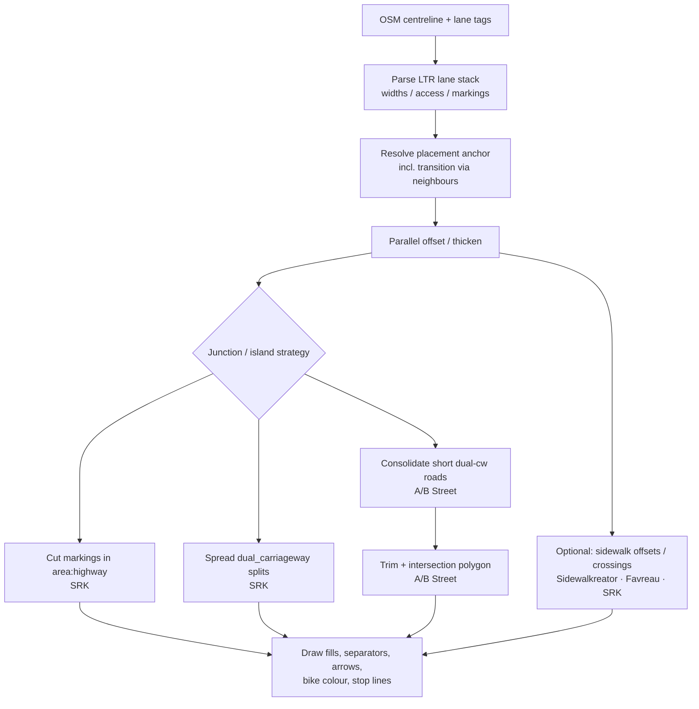

# How can centreline-based road/lane data be rendered as realistic-but-abstract lane maps (incl. bike, sidewalk, crossings) for short segments?

## Short answer

There is **no mature peer-reviewed cartographic “lane renderer” literature** that solves splits, merges, and traffic islands end-to-end. The closest published OSM cartography is Seidel’s Neukölln street-space map (KN 2022; FOSSGIS 2022), which states that centreline ways encode the whole carriageway and must be **interpreted, geometrically offset, and duplicated** by lane count/width before drawing (Seidel, 2022, KN A-14–A-15). In practice, three complementary engineering lineages dominate: **(A)** parallel-offset cross-sections with `placement` (Map Machine, Imagico AC-style, Straßenraumkarte preprocessing); **(B)** thicken–trim–polygon intersection geometry plus dual-carriageway consolidation (A/B Street / osm2streets); **(C)** cut-out junctions via `area:highway` and special dual-carriageway “spreading” so markings stay straight past islands (Straßenraumkarte blog + code). Academic work on **lane-level HD maps** targets centimetre AV navigation, not map abstraction (Zheng et al., 2019, abstract); cartographic road **generalization** literature (e.g. Šuba et al., 2016) addresses continuous scale change between area and line roads, not per-lane markings.

**Synthesis (labeled):** For short-segment preview from road/lane tags, the workable stack is: parse LTR lane stack → metric offsets with placement → draw markings/fills → handle transitions (`placement=transition` / degenerate mid-block junctions) → either cut junction interiors or consolidate dual-carriageway clusters → optionally add sidewalk/crossing geometry from tags or derived offsets.

---

## Research framing

| Item | Choice |
|------|--------|
| **Question** | What algorithms, methods, papers, tools, and examples exist for drawing lanes (and bike/sidewalk/crossing elements) accurately yet abstractly on maps from centreline-oriented data, including lane splits and traffic-island splits? |
| **Scope** | Cartography / OSM practice / street-network modelling; DE+EN; 2010–2026 emphasis; short segments first |
| **Include** | Lane offset/rendering, intersection polygons, dual carriageways, sidewalk/crossing geometry, OSM preprocessing |
| **Exclude as primary** | Camera lane *detection* for ADAS; pure routing without geometry |

### Sub-questions

1. What does the scholarly record say about lane-level geometry from road networks?
2. How do cartographic OSM systems turn centreline + tags into drawn lanes?
3. How are splits, merges, medians/islands, and junctions handled?
4. How are bike tracks/lanes, sidewalks, and crossings integrated?
5. What gaps remain for a short-segment abstract renderer?

---

## Findings

### 1. Scholarly record: lane-level maps ≠ cartographic abstraction

- **Claim:** Surveyed lane-level road-network generation for AVs focuses on building precise lane graphs from sensors/trajectories, not on map styling abstraction.
  - **Evidence:** “A lane-level map is essential for autonomous driving, and a lane-level road network is a fundamental part of a lane-level map. … This paper presents an overview of lane-level road network generation techniques for the lane-level maps of autonomous vehicles” (Zheng, Wang & Wang, 2019, abstract).
  - **Source:** DOI [10.3390/su11164511](https://doi.org/10.3390/su11164511) (OpenAlex W2968915115; S2 citation graph retrieved 2026-07-29)
  - **Caveat:** Full PDF blocked (HTTP 403) in this session; claim bound to API abstract only. Citation graph cites/extends MLS/trajectory pipeline papers — AV pipeline, not map design.

- **Claim:** Continuous road-network generalization research targets smooth morphing between **area-represented** roads at large scale and **line** roads at smaller scales — related to “realistic vs abstract” width, not lane stripes.
  - **Evidence:** “Until now, road network generalization has mainly been applied to the task of generalizing from one fixed source scale to another fixed target scale. These actions result in large differences in content and representation, e.g., a sudden change of the representation of road segments from areas to lines… Therefore, we aim at the continuous generalization of a road network for the whole range, from the large scale, where roads are represented as areas, to mid- and small [scales]” (Šuba, Meijers & van Oosterom, 2016, abstract).
  - **Source:** DOI [10.3390/ijgi5080145](https://doi.org/10.3390/ijgi5080145)
  - **Caveat:** Abstract-only in this session (PDF 403). Follow-up citations (S2) stay in generalization/morphing, not OSM lane tags.

- **Claim:** Mobility-space visualization literature quantifies how much street space modes occupy (useful design metaphor), but does not specify lane-split algorithms.
  - **Evidence:** “Most cities are car-centric, allocating a privileged amount of urban space to cars at the expense of sustainable mobility like cycling. … here we explore how crowdsourced data can help to advance its under[standing]” (Szell, 2018, abstract).
  - **Source:** DOI [10.17645/up.v3i1.1209](https://doi.org/10.17645/up.v3i1.1209)
  - **Caveat:** Cogitatio HTML fetch returned a challenge page; abstract from OpenAlex only.

- **Claim (gap):** OpenAlex/Crossref/DNB discovery did **not** surface a high-citation paper that implements OSM `lanes`/`placement` cartography comparable to Straßenraumkarte. The primary scholarly hit for that project is Seidel (below), via DNB/KartDok + KN ESM PDF.

### 2. Cartographic OSM practice: interpret centreline, then offset

- **Claim:** Seidel’s street-space map treats OSM highway ways as abstract centreline carriers of the whole carriageway; rendering requires interpreting lane attributes and generating offset geometries.
  - **Evidence:** “Im Fall einer Straße bzw. Fahrbahn ist das Datenobjekt beispielsweise eine Linie, welche die gesamte Fahrbahn mit all ihren Eigenschaften und einzelnen Spuren repräsentiert. … Informationen zu einzelnen, auch gegenläufigen Fahrspuren oder Radstreifen auf der Fahrbahn sind also alle in einem einzelnen Geoobjekt vereinigt und müssen für die Kartendarstellung interpretiert, geometrisch erzeugt und versetzt und passend dargestellt werden.” (Seidel, 2022, KN *Info und Praxis* 3/2022, pp. A-14–A-15).
  - **Evidence (what is drawn):** “werden die Liniengeometrien der Straßensegmente entsprechend der Anzahl und Breite der Fahrspuren vervielfältigt und versetzt. In der Karte dargestellt werden vor allem die Begrenzungen (z. B. Mittellinien) oder Symbole (Abbiegepfeile, Rad- oder Busspur-Embleme) der Fahrspuren. Die Fahrbahnflächen selbst sind durch darunter liegende Polygone repräsentiert” (ibid., A-15).
  - **Source:** KN ESM PDF (Springer supplementary for KN 72(3) 2022); also FOSSGIS 2022 abstract, URN [urn:nbn:de:0307-20240411-008-1](https://nbn-resolving.org/urn:nbn:de:0307-20240411-008-1)

- **Claim:** Aesthetic stance is architecture-plan realism with **little generalization** at large scale — i.e. “realistic but still a plan,” not schematic diagram.
  - **Evidence:** “Aus einer strengen kartographischen Perspektive ist sie weniger eine Karte als vielmehr ein Plan, da sie für große Maßstäbe ausgelegt ist und weitgehend auf Generalisierung verzichten kann.” (Seidel, 2022, KN A-13).
  - **Source:** same KN ESM

- **Claim:** Imagico’s experimental AC-style road rendering uses ground-unit width from `width` or estimated from `lanes`, then draws evenly spaced lane dividers at high zoom — and already flags **transitions** and **`placement`** as unsolved for that style.
  - **Evidence:** “If a width is tagged use that as the ground width. If no width is tagged but the number of lanes is tagged then estimate the overall ground width based on the road class and (conservatively estimated) the typical lane width… Lanes visualization… follows the implicit rules documented which say that trunk roads and motorways are assumed by default to be two lanes.” / “Of course this style of visualization for both the lanes and the tagged width of the road does not work too well when the number of lanes and the road width changes. This requires mapping and interpretation of additional data, in particular what is mapped with placement=*, which is currently not taken into account.” (Hormann / Imagico, 2021, *Navigating the Maze – part 2*).
  - **Source:** https://blog.imagico.de/navigating-the-maze-part-2/ (fetched via Wayback; live URL 500 during session)
  - **Link to Map Machine:** Map Machine Road Lanes cites this post; repo note in [map-machine.md](../lane-editor-tags/projects/map-machine.md).

- **Claim:** Map Machine implements the simple end of the spectrum: total width from `width` or `lanes×3.7 m`, optional `width:lanes` and `placement`, equal-spaced dashed separators — not turn/bike semantics.
  - **Evidence:** Project research (source-reviewed code paths): `--roads lanes`; separators when `lanes≥2`; placement offsets (`left_of`/`middle_of`/`right_of`/`transition`). See [map-machine.md](../lane-editor-tags/projects/map-machine.md).
  - **Source:** https://github.com/enzet/map-machine (`feature/road.py`); secondary synthesis in repo notes.

### 3. Splits, merges, islands, junctions — two opposing strategies

#### 3a. Straßenraumkarte: keep OSM topology; fix drawing locally

- **Claim:** Traffic islands that split a bidirectional way into dual carriageway fragments break naive offset rendering; SRK detects `dual_carriageway=yes` adjoining non-dual segments and **spreads** geometry so markings continue straight past the island.
  - **Evidence:** “A key challenge for the correct rendering of lanes are situations, when lanes split to create room for eg. traffic islands. … Without any special treatment, the lanes would show up wrong … The goal is to show the lane markings as going more or less straight past the traffic island. … we use the tag `dual_carriageway=yes` … the script can now check where a lane segment with `dual_carriageway=yes` connects to a lane segment without the tag and then split and spread the lane” (Straßenraumkarte micromap update, 2021-12-31).
  - **Source:** https://strassenraumkarte.osm-berlin.org/posts/2021-12-31-micromap-update  
  - **Implementation detail (repo research):** neighbour continuity (same `name`+`highway`, angle &lt; 70°); `offsetVertex` spreading; skipped when `placement:*:start` present — [strassenraumkarte.md](../lane-editor-tags/projects/strassenraumkarte.md).

- **Claim:** Complex junctions are treated as **unsolved for full lane connectivity**; practical cartographic solution is to **cut out** markings inside `area:highway` + `junction=yes` polygons.
  - **Evidence:** “Getting junctions right based on OSM data is hard. … Lanes and turn lanes on the junction: Unfortunately, this is still not solved. … Alex’ solution … is to not render any lane markings for junctions. To specify the cut out area, all complex junctions … are mapped with `area:highway=… + junction=yes`” (micromap update, 2021-12-31).
  - **Source:** same blog; points to Carlino SOTM 2021 (~12:30) for A/B Street junction issues.

- **Claim:** Gradual mid-block lane/width change is modelled with `placement=transition` plus start/end placement (and related width start/end tags), resolved against neighbour segments — not as a graph merge.
  - **Evidence:** Tag/processing catalogue in [strassenraumkarte.md](../lane-editor-tags/projects/strassenraumkarte.md) §3–4 (`placement:start`/`end`, neighbour linking). Blog documents `placement=right_of:N` as the geometric anchor for accurate bike-lane position.

#### 3b. A/B Street / osm2streets: thicken, trim, polygonize; consolidate dual carriageways

- **Claim:** Desired cartographic/simulation representation partitions paved space into road segments and intersection polygons; lanes are LTR projections of a centreline+width model.
  - **Evidence:** “A simplifying assumption, mostly coming from OSM, is that roads can be represented as a center-line and width, and individual lanes can be formed by projecting that center-line left and right. This means when the road changes width in the middle (like for pocket parking or to make room for a turn lane), we have to model that transition as a small ‘degenerate’ intersection, which connects only those two roads.” (Carlino, 2021, *Intersection geometry*).
  - **Source:** https://a-b-street.github.io/docs/tech/map/geometry/index.html

- **Claim:** Core algorithm: thicken roads by lane-derived width → find side collisions → trim centre-lines → assemble intersection polygon (clockwise walk of endpoints + collision points); roads assumed to meet intersections **perpendicularly**.
  - **Evidence:** Process steps “1. Pre-process OSM… 2. Thicken each road 3. Trim back the roads based on overlap 4. Produce the intersection polygon” and perpendicular assumption (Carlino, 2021, same page).
  - **Caveat (author):** “Pedestrian islands, slip lanes, gores, and medians are all real-world elements that don't fit nicely in this model.”

- **Claim:** Dual carriageways / medians create clusters of short OSM segments that must be **consolidated** into one logical intersection for coherent geometry (and simulation).
  - **Evidence:** “In OSM, roads with opposite directions of traffic separated by any sort of center median … are mapped as two parallel one-way roads. … When these intersect, we wind up with lots of short ‘road segments’ and several intersections all clustered together… with the algorithm described so far … it's completely visually incomprehensible… In A/B Street, we aim to ‘consolidate’ this cluster into just one intersection.” (Carlino, 2021). Trigger often `junction=intersection`; automatic short-road heuristics still fragile.
  - **Source:** same geometry article; osm2streets transforms `CollapseShortRoads`, `MergeDualCarriageways` (experimental) — [how_it_works.md](https://raw.githubusercontent.com/a-b-street/osm2streets/main/docs/how_it_works.md) / [osm2streets.md](../lane-editor-tags/projects/osm2streets.md).

- **Interpretation:** SRK **preserves** dual-carriageway split topology and corrects drawing with spreading + junction cut-outs. A/B Street **rewrites** topology toward a render/simulation-friendly graph. For a short-segment editor preview, SRK-style local fixes are usually cheaper; for network-consistent polygons, osm2streets-style consolidation matters.

### 4. Bike infrastructure, sidewalks, crossings

- **Claim:** SRK renders on-carriageway bike lanes by expanding the lane stack (`cycleway:*=lane` / `cycleway:lanes`) and offsetting with widths, buffers, separation, and surface colour — about two thirds of preprocessing effort.
  - **Evidence:** “Processing all this correctly now makes up for about two thirds of the pre-processing script.” / placement + `width:lanes` examples for mid-road exclusive bike lanes (micromap update, 2021-12-31). Seidel KN lists Radfahrstreifen among attributes that must be interpreted and offset (A-14–A-15).
  - **Source:** blog + KN ESM; detailed tag table [strassenraumkarte.md](../lane-editor-tags/projects/strassenraumkarte.md).

- **Claim:** osm2streets models sidewalks/bike as lane types in the LTR stack and optionally **zips** separately mapped sidepaths onto the main road (experimental).
  - **Evidence:** “A lane represents any longitudinal feature of a road: travel lanes on the carriageway, separated bike and footpaths, street-side parking, and buffers, medians and verges.” / `ZipSidepaths` experimental (osm2streets `how_it_works.md`, Nov 2022 snapshot).
  - **Source:** https://github.com/a-b-street/osm2streets/blob/main/docs/how_it_works.md

- **Claim:** Separate sidewalk geometries can be algorithmically generated from road axes when OSM only has centreline sidewalk tags — complementary to lane rendering.
  - **Evidence:** “The current method of mapping pavement in OSM has limitations, as it relies solely on the road axis as the primary geometry. … A better strategy would involve creating separate geometries for sidewalks… The plugin workflow encompasses … sidewalk geometries generation; crossings and kerbs generation…” (Vestena, Camboim & dos Santos, 2023, pp. 66–67 / abstract).
  - **Source:** DOI [10.48088/ejg.k.ves.14.4.066.084](https://doi.org/10.48088/ejg.k.ves.14.4.066.084); PDF retrieved.

- **Claim:** Pedestrian-oriented intersection segmentation uses crossings and signals as **boundaries** of the junction area — useful for where to stop drawing carriageway lanes and where to draw crossings.
  - **Evidence:** “By combining the geometry, topology and semantics of the urban automobile network of OpenStreetMap, we propose an algorithm for locating elementary intersections, and then successively assembling them in a multi-scale approach… our approach relies on the elements that constitute the boundaries of these intersections, such as pedestrian crossings and traffic lights.” (Favreau & Kalsron, 2022, abstract). “the boundary between the central region (the intersection) and the adjacent regions (the branches) will generally be located at the level of the pedestrian crossings for each branch” (p. 2).
  - **Source:** DOI [10.5194/agile-giss-3-4-2022](https://doi.org/10.5194/agile-giss-3-4-2022); PDF retrieved.

- **Claim:** SRK draws detailed crossings (zebra, buffer marking, signal) by deriving lines from foot infrastructure / nodes and clipping to kerbs — including node-only crossings on the main way.
  - **Evidence:** Micromap update §“Pedestrian crossings”; stop lines follow `area:highway` outline when present, else perpendicular at signal/stop node (2021-12-31).
  - **Source:** blog; processing notes in [strassenraumkarte.md](../lane-editor-tags/projects/strassenraumkarte.md).

### 5. Input data implications (for this project)

| Input you already have | Role in rendering |
|------------------------|-------------------|
| Centreline ways + `lanes` / `lanes:forward`/`backward` | Base stack size |
| `width` / `width:lanes` (+ directional) | Metric offsets; prefer over defaults |
| `placement` (+ start/end / directional) | Anchors way in cross-section; required for asymmetric stacks & transitions |
| `cycleway:*` / `cycleway:lanes` / separation / buffer | Expand stack + styling (SRK path) |
| `turn:lanes`, `change:lanes`, `lane_markings`, `overtaking` | Marking style / symbols |
| Optional context | `dual_carriageway`, `area:highway`+`junction`, kerbs/`barrier=kerb`, crossing ways/nodes, separately mapped `highway=cycleway`/`footway`, ALKIS/building polygons for carriageway fill (SRK uses ALKIS for Fahrbahn polygons — Seidel KN A-12) |

**Fact:** Seidel notes bus-lane tagging has “drei konkurrierende Schemata” and schemas may be incomplete/contradictory (KN A-14–A-15) — parsers must normalize (cf. muv-osm / osm2lanes lineage in [osm2streets.md](../lane-editor-tags/projects/osm2streets.md)).

---

## Methods map (synthesis)

---

## Source list

| # | Citation | Year | Type | DOI / ID | OA / access | Why included |
|---|----------|------|------|----------|-------------|--------------|
| 1 | Seidel, A. Die Neuköllner Straßenraumkarte… *KN Info und Praxis* 3/2022 A-10–A-19 | 2022 | Journal supplement | KN ESM for 10.1007/s42489-022-00119-1 package; FOSSGIS URN `de:0307-20240411-008-1` | PDF retrieved (ESM + KartDok abstract) | Primary cartographic description of OSM lane offset rendering |
| 2 | Straßenraumkarte micromap update (blog) | 2021 | Practice | — | https://strassenraumkarte.osm-berlin.org/posts/2021-12-31-micromap-update | Dual-carriageway spreading, junction cut-out, bike/crossing methods |
| 3 | Carlino, D. Intersection geometry (A/B Street) | 2021 | Eng. docs | — | https://a-b-street.github.io/docs/tech/map/geometry/index.html | Thicken/trim/polygonize + consolidation algorithms |
| 4 | osm2streets `docs/how_it_works.md` | 2022 | Eng. docs | — | GitHub a-b-street/osm2streets | Network transforms, lane model |
| 5 | Hormann, C. Navigating the Maze – part 2 | 2021 | Blog | — | imagico.de (Wayback) | Ground-unit width + lanes viz; placement gap |
| 6 | Zheng et al. Lane-Level Road Network Generation… Survey | 2019 | Journal | 10.3390/su11164511 | Abstract (PDF 403) | AV lane-level SOTA boundary |
| 7 | Šuba et al. Continuous Road Network Generalization… | 2016 | Journal | 10.3390/ijgi5080145 | Abstract (PDF 403) | Area↔line road abstraction / scale |
| 8 | Favreau & Kalsron. What are intersections for pedestrian users? | 2022 | Conference | 10.5194/agile-giss-3-4-2022 | PDF retrieved | Crossing-bounded intersection areas |
| 9 | Vestena et al. OSM Sidewalkreator | 2023 | Journal | 10.48088/ejg.k.ves.14.4.066.084 | PDF retrieved | Sidewalk/crossing geometry generation |
| 10 | Szell, M. Crowdsourced… Mobility Space Inequality | 2018 | Journal | 10.17645/up.v3i1.1209 | Abstract | Street-space allocation visualization framing |
| 11 | Map Machine; osmberlin/strassenraumkarte-neukoelln | — | Code | — | GitHub | Executable methods |
| 12 | Repo project notes | 2026 | Secondary | — | `research/lane-editor-tags/projects/*` | Code/tag deep dives already done |

**Note on DOI 10.1007/s42489-022-00119-1:** OpenAlex/S2 resolve this DOI to Schiewe’s editorial title *„Tue Gutes und sprich darüber!“* (metadata conflict). The Seidel street-space article was retrieved from the **KN 3/2022 Info und Praxis ESM PDF** (pages A-10 ff.), which the Straßenraumkarte README also cites. Prefer URN/KartDok + ESM over that DOI for Seidel.

---

## Gaps and open questions

1. **Junction turn-lane connectivity** remains unsolved in SRK; approved `road_marking=*` (2025) is a data-side escape hatch not yet consumed by SRK ([road-marking.md](../lane-editor-tags/tags/road-marking.md)).
2. **Automatic dual-carriageway consolidation** heuristics still unreliable (Carlino, 2021); SRK’s spreading is local and tag-dependent (`dual_carriageway`).
3. Little peer-reviewed evaluation of **cartographic quality** (legibility, error rates) for lane-offset maps — mostly demos and FOSS talks.
4. AV **HD map** literature does not transfer cleanly to abstract OSM maps without a deliberate generalization layer (Šuba-style continuous generalization is about road polygons, not lane semantics).
5. For short segments only: still need a policy for **segment endpoints** (butt caps vs miters vs fade) when neighbour context is missing — Imagico/Map Machine ignore placement transitions; SRK needs neighbours.

---

## Search log (brief)

| When | API / source | Query / action | Result |
|------|--------------|----------------|--------|
| 2026-07-29 | Env | `SEMANTIC_SCHOLAR_API_KEY`, `OPENALEX_API_KEY`, `BASE_API_KEY` | All unset |
| 2026-07-29 | OpenAlex works search | `lane geometry rendering…`, `road lane visualization map OpenStreetMap`, `street space…`, `Straßenraumkarte`, `generating lane polygons…`, `map matching lane-level…`, cartography/casement/schematic variants | Many AV/OSM hits; few cartographic lane renderers; Seidel DOI metadata mismatch |
| 2026-07-29 | Crossref | `Straßenraumkarte Neukölln lane`; `lane-level road map generation from OpenStreetMap` | Weak for SRK; useful lane-level AV DOIs (e.g. 10.3390/su11164511) |
| 2026-07-29 | DNB SRU | `tit=Straßenraumkarte OR tit=Fahrstreifen Kartographie` | Seidel FOSSGIS/KartDok hit |
| 2026-07-29 | S2 search | cartographic road lane… | **429** (no key) |
| 2026-07-29 | S2 paper/citations | DOI 10.3390/su11164511, 10.3390/ijgi5080145, 10.17645/up.v3i1.1209 | Citation graphs OK |
| 2026-07-29 | Full text | KN ESM PDF; Favreau; Sidewalkreator; Seidel KartDok; Imagico Wayback; A/B Street geometry; micromap blog; osm2streets how_it_works | Deep-read |
| 2026-07-29 | Full text fail | MDPI PDFs & Cogitatio PDF **403**; Imagico live **500** | Abstracts / Wayback used |

Discovery queries used: **6** OpenAlex batches (+ DOI hydrates); deep-read sources: **Seidel KN, micromap blog, Carlino geometry, Imagico, Favreau, Sidewalkreator** (+ code notes).
