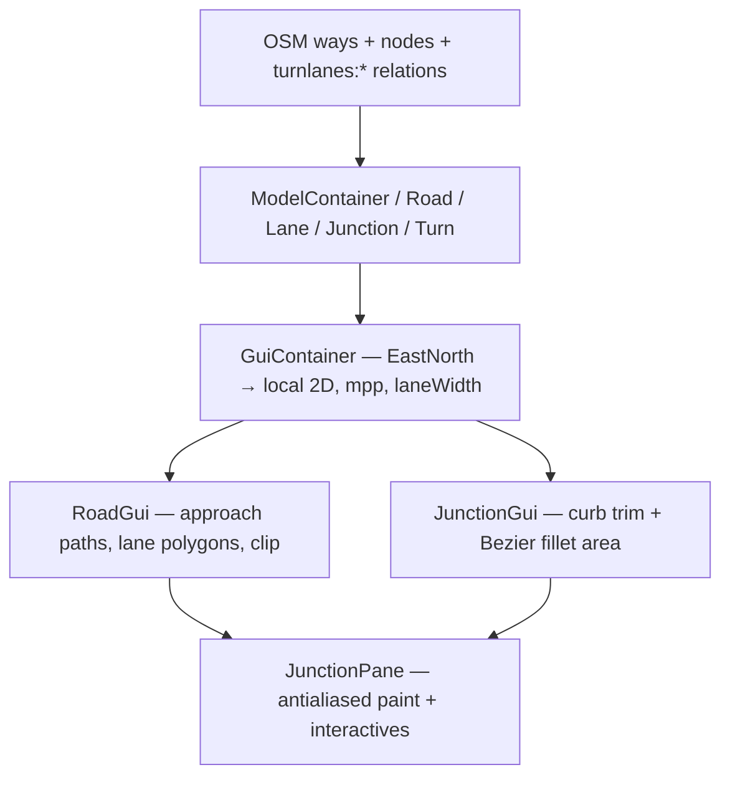

# JOSM turnlanes renderer — why the lane-style look works

Deep dive into the geometry behind [Proposal:Turn lanes (relation)](https://wiki.openstreetmap.org/wiki/Proposal:Turn_lanes_(relation)#Plugin) and the JOSM **turnlanes** plugin GUI. Focus: **smooth carriageway borders, pocket-lane flares, junction fills, and lane connectivity** — not colours.

**Fetched 2026-08-06.** Tagging / status: [../lane-editor-tags/projects/josm-turnlanes-core.md](../lane-editor-tags/projects/josm-turnlanes-core.md). Methods context: [methods-catalogue.md](./methods-catalogue.md).

---

## Verdict (read this first)

| Question | Answer |
|----------|--------|
| Are the wiki “example” screenshots hand-drawn? | **Mixed.** Road asphalt / dashes / flares / junction fillet are the same class of geometry the **live plugin paints**. Way # labels, blue length brackets, pavement turn arrows, and yellow numbered nodes on the proposal figures are **didactic overlays** — the GUI does **not** draw those. |
| Is there real code? | **Yes.** GPL Java plugin (Benjamin Schulz / benshu), still listed in JOSM plugins as `turnlanes.jar`. Mirror: [tsmock/turnlanes](https://github.com/tsmock/turnlanes). |
| Why does it look better than a messy centreline offset? | It treats the junction as a **trimmed, filled polygon with cubic fillets**, clips approaches against that polygon, and builds **pocket lanes with metre-parameterized width tapers** (`Path.offset(ws, m1, m2, we)`), not hard steps. |
| Can we copy this wholesale? | Only if we adopt a **junction-local 2D model** (node + incident roads + optional length relations). Our short-segment corridor sketch ([docs/lanes-road-space-approach.md](../../docs/lanes-road-space-approach.md)) is a different product job. Steal the **taper + fillet + clip** ideas. |

---

## Image provenance

Wiki files (uploader **Benshu**, 2011-03):

| File | Size | Wiki caption | Nature |
|------|------|--------------|--------|
| [Turnlanes_gui.png](https://wiki.openstreetmap.org/wiki/File:Turnlanes_gui.png) | 391×346 | “Screenshot of the turnlanes plugin GUI” + JOSM screenshot license | **Authentic GUI** — blue canvas, gray lanes, “+” lane adders, green turn strokes, blue length “10,0m”, red junction/segment dots |
| [Turn_lane_lengths.png](https://wiki.openstreetmap.org/wiki/File:Turn_lane_lengths.png) | 3019×4000 @ ~1813 DPI | “Example for two turn lanes…” | **Proposal figure** — plugin-like asphalt + **hand annotations** (blue 32m/37m/20m brackets, Way #4/#5, yellow “1”) |
| [Turn_lanes_turns_example.png](https://wiki.openstreetmap.org/wiki/File:Turn_lanes_turns_example.png) | 3511×4000 | “Example of a right turn…” | **Proposal figure** — same; pavement arrows + lane addresses `1`/`2`/`1*` are didactic |
| [Turn_lane_addressing.png](https://wiki.openstreetmap.org/wiki/File:Turn_lane_addressing.png) | 3019×4000 | “Depicts lane addresses…” | **Proposal figure** |

Local copies: [assets/](./assets/).

**What the live GUI actually paints** ([`JunctionPane.paintPassive`](https://github.com/tsmock/turnlanes/blob/master/src/org/openstreetmap/josm/plugins/turnlanes/gui/JunctionPane.java), [`RoadGui.paintLanes`](https://github.com/tsmock/turnlanes/blob/master/src/org/openstreetmap/josm/plugins/turnlanes/gui/RoadGui.java), [`JunctionGui.paint`](https://github.com/tsmock/turnlanes/blob/master/src/org/openstreetmap/josm/plugins/turnlanes/gui/JunctionGui.java)):

- Blue background `(100,160,240)`
- Gray approach polygons + darker gray junction polygon
- White solid outer / dashed inner lane lines
- Connector disks; green/red **turn connection strokes** along lane middles (not pavement arrows)
- Length text only on the active extra-lane slider (`LengthSlider`)
- Tiny red dots at segment/junction centres

It does **not** paint: Way # labels, dimension brackets, yellow numbered nodes, or white turn arrows on the asphalt.

---

## Architecture

| Layer | Classes | Role |
|-------|---------|------|
| Model | `Road`, `Lane`, `Junction`, `Turn`, `Route`, `Constants` | Parse `lanes*` + `type=turnlanes:lengths` / `turnlanes:turns` |
| Path math | `Path` (Line / Curve / Start), `GuiUtil` | Offset curves, cubic arc approx (`cpf`), polygon from inner∪outer |
| View | `RoadGui`, `LaneGui`, `JunctionGui`, `JunctionPane` | Paint + hit-testing for edit |

Coordinate system ([`GuiContainer`](https://github.com/tsmock/turnlanes/blob/master/src/org/openstreetmap/josm/plugins/turnlanes/gui/GuiContainer.java)):

- Nodes → `EastNorth`, Y flipped for screen
- Translate so primary junctions average at origin; scale so **0.5 m/px** (`mpp`)
- Fixed **lane width** in metres → pixels (`laneWidth = 1.0 / mpp`)
- This is a **junction-centred schematic**, not a map tile renderer

---

## Geometric tricks that create the “nice” look

### 1. Junction = filled polygon with cubic fillets (not crossing thick strokes)

[`JunctionGui.recalculate`](https://github.com/tsmock/turnlanes/blob/master/src/org/openstreetmap/josm/plugins/turnlanes/gui/JunctionGui.java):

1. Angle-sort incident road ends around the node.
2. For each pair of adjacent approaches, intersect **left curb of one** with **right curb of the next** → compute **trim distances** (`lTrim` / `rTrim`) so road rectangles pull back from the node.
3. Cap extreme miters (`MAX_ANGLE` = 30°).
4. Build a closed `Path2D`: for each corner, `lineTo` curb point A, then **`curveTo`** with control points from `GuiUtil.cpf(a, scale)` — the standard **cubic approximation of a circular arc** (`4/3 · tan(a/4) · radius`).
5. Fill with darker gray.

That is why crossings look like continuous pavement with **rounded inner corners** instead of a star of overlapping fat polylines.

### 2. Approaches are clipped against the junction

[`RoadGui.clip` / `negativeClip`](https://github.com/tsmock/turnlanes/blob/master/src/org/openstreetmap/josm/plugins/turnlanes/gui/RoadGui.java): lane fills and dashed separators are drawn under a clip region that **subtracts** the junction-side wedges. Markings stop cleanly at the fillet boundary — no dashed lines through the intersection “soup.”

### 3. Pocket / extra turn lanes use width tapers, not steps

[`Path.offset(ws, m1, m2, we)`](https://github.com/tsmock/turnlanes/blob/master/src/org/openstreetmap/josm/plugins/turnlanes/gui/Path.java) — documented as a “somewhat crude straight skeleton” for parallel curves. Between chainage `m1` and `m2`, offset width **linearly interpolates** from `ws` → `we`.

[`LaneGui.recalculate`](https://github.com/tsmock/turnlanes/blob/master/src/org/openstreetmap/josm/plugins/turnlanes/gui/LaneGui.java) for extras:

| Kind | Outer offset call (conceptually) | Taper |
|------|----------------------------------|-------|
| `EXTRA_LEFT` | `inner.offset(W, SL, SL+AL, 0)` | `AL ≈ 30 m` flare from full width → 0 |
| `EXTRA_RIGHT` | `inner.offset(W, L, L+WW, 0)` | `WW ≈ 3 m` short flare |
| `REGULAR` | `inner.offset(W, -1, -1, W)` | Constant width |

Lengths come from `type=turnlanes:lengths` (`lengths:left` / `lengths:right`, metres, inside→outside). The outer asphalt edge therefore **S-curves** where a pocket begins — this is the flare in the lengths figure.

**Note:** `RoadGui.ROUND_CORNERS` (rounding bends of the **centreline** path) is **hard-coded `false`** — “still slightly buggy.” Smooth pocket borders are from **width interpolation**, not centreline rounding.

### 4. Continuous asphalt polygons (not stroked centrelines)

[`GuiUtil.area(inner, outer)`](https://github.com/tsmock/turnlanes/blob/master/src/org/openstreetmap/josm/plugins/turnlanes/gui/GuiUtil.java): append inner path, reverse-append outer path, `closePath`, fill. Each direction’s carriageway is a real region; separators are separate dashed strokes along successive offset paths.

### 5. Lane connectivity = paths along lane middles (editor overlay)

[`JunctionGui.TurnConnection`](https://github.com/tsmock/turnlanes/blob/master/src/org/openstreetmap/josm/plugins/turnlanes/gui/JunctionGui.java): from outgoing connector → append `getLaneMiddle` along via roads → to incoming connector. Drawn green/red with round-capped stroke. Ctrl+A → `State.AllTurns` shows all.

That is **connectivity visualisation**, not painted turn arrows. The proposal’s white/blue arrows are teaching art for `turnlanes:turns` addressing.

### 6. Antialiasing + metric consistency

`KEY_ANTIALIASING_ON`; all widths derived from one `laneWidth`; dash pattern ≈ `laneWidth/2` / `laneWidth/3`. Edges look “vector clean” because they are metric offsets + AA, not pixel-thick map styles.

---

## Data the renderer needs (beyond `lanes=`)

| Input | Use in geometry |
|-------|-----------------|
| `lanes` / `lanes:forward` / `lanes:backward` / oneway | Regular lane counts per approach end |
| `type=turnlanes:lengths` + `lengths:left`/`right` + `end` + `ways` | Extra pocket lengths (metres) along route to junction |
| `type=turnlanes:turns` + `lanes` / `lanes:extra` + from/via/to | Which connectors to link (paint overlay) |
| Dual-carriageway **via ways** | Turn paths that thread through intermediate ways |
| **Implicit** fixed lane width | No `width:lanes` — uniform LW everywhere |

Proposal status: **Obsoleted**; wiki points to `turn(:lanes)` + [Relation:connectivity](https://wiki.openstreetmap.org/wiki/Relation:connectivity). The **renderer techniques remain instructive** even if the relation schema is dead.

---

## Contrast with our setup

| Concern | JOSM turnlanes | Our plan sketch (`osm-lane-diagram` / road-space) |
|---------|----------------|--------------------------------------------------|
| Scope | Junction-local network (all arms) | Short corridor of one way ± neighbours |
| Junction | Explicit fillet polygon + clip | Often absent / stubby / messy joins |
| Pocket lanes | Length-tagged extras + metre tapers | Usually full-length slots or hard width steps |
| Connectivity | Editable turn paths through junction | Out of scope for sketch v1 |
| Width model | Constant LW | Per-lane / defaults / provenance |
| Output | Interactive Java2D editor | SVG QA sketch + matrix edit |

**What to steal for smoother borders (without adopting the obsolete relations):**

1. **Width-parameterized offset tapers** when lane count changes along a corridor (or when we invent “pocket” length from neighbour geometry) — `offset(w0, s0, s1, w1)`.
2. **Trim approaches + cubic fillet fill** at the selected way’s end node when neighbours exist — even a simplified 2–3 arm fillet beats overlapping rectangles.
3. **Clip lane dashes against the junction polygon** so markings don’t run into the intersection blob.
4. Keep turn **arrows as lane attributes** (our tag model); optionally add **connection strokes** later like Ctrl+A — don’t confuse didactic wiki arrows with required paint.

**What not to cargo-cult:** obsolete `turnlanes:*` relations as the write target; fixed 3 m lane width; full dual-carriageway via editor UX.

---

## Sources

- Proposal: https://wiki.openstreetmap.org/wiki/Proposal:Turn_lanes_(relation)
- Plugin source: https://github.com/tsmock/turnlanes (esp. `gui/Path.java`, `RoadGui.java`, `LaneGui.java`, `JunctionGui.java`, `GuiUtil.java`, `GuiContainer.java`)
- JOSM SVN browser: https://josm.openstreetmap.de/browser/osm/applications/editors/josm/plugins/turnlanes/
- Dist: https://josm.openstreetmap.de/osmsvn/applications/editors/josm/dist/turnlanes.jar
- Distinct plugin (Mapbox `turn:lanes` tags): [josm-turnlanes-tagging.md](../lane-editor-tags/projects/josm-turnlanes-tagging.md)
