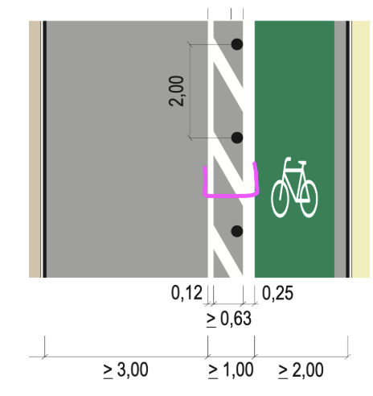
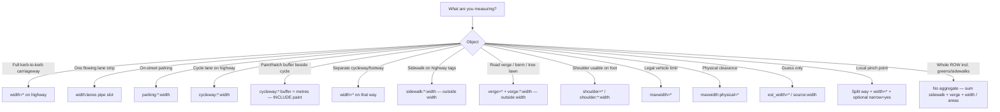

# Width measurements in OSM street space

Deep dive on how OSM tags describe **physical widths** of roads, lanes, cycle infrastructure, buffers, and related limits — and how those tags interact.

Sibling package: [lane-editor-tags](../lane-editor-tags/) (lanes / `:lanes` editor research). Short lane-editor tag card: [width-and-surface.md](../lane-editor-tags/tags/width-and-surface.md). Source list: [sources.md](./sources.md). Researched **2026-07-26**.

## Verdict (read this first)

| Question | Answer | Confidence |
|----------|--------|------------|
| What does `width=*` mean on a street? | **Carriageway kerb→kerb** (or edge→edge): includes on-street parking + on-carriageway cycle lanes; **excludes** sidewalks and off-kerb cycle tracks / street-side parking | **Clear** (wiki since ~2020; expect older fuzzy data) |
| Is `sum(width:lanes) == width`? | **Only when** there is no parking, no shoulder, no untagged gutter, **and** no longitudinal paint outside the lane slots. Otherwise `width` is larger | **Clear** that equality often fails (SC #5593); **paint term is a logical assumption** (see §2.2) |
| Do motor `width:lanes` values include painted lines? | **Not documented** on the wiki. **Logical assumption (editor):** slots are **clear width between markings** (paint excluded), analogous to Berlin cycleway practice. Paint strokes are part of kerb→kerb `width=*` and must be added separately when reconciling | **Assumption** — not wiki text |
| Do cycleway **usable** widths include paint? | Berlin practice: **distance between boundary lines** (`cycleway:*:width`) | **Clear for Berlin schema** |
| Do **buffer** widths include paint / hatching? | Berlin / ERA-style practice documented for OSM: **yes — markings are counted in `buffer`** | **Clear for Berlin numeric buffer**; global `cycleway:buffer` mostly `yes`/`no` |
| Is there a tag for total ROW (carriageway + sidewalks + green median)? | **No single key.** Compose from components: `sidewalk:*:width`, `verge` / `verge:*:width`, `width=*`, separate areas | **Clear** (components exist; no aggregate) |
| Narrowings? | **Split the way** and set `width=*` (or `est_width`) on the narrow segment; optional `narrow=yes` / `hazard=road_narrows` | **Clear** |
| Unmarked roads (`lane_markings=no`) — `width` or `lanes`? | Prefer **`width=*` (+ street parking tags)**; they are more meaningful / verifiable than guessing `lanes=*` from width. `lanes=*` still OK when clearly surveyable (traffic, signs, stub centreline) — not invented from metres alone | **Clear for preferring width** (Supaplex030, forum Mar 2026); **situational** for whether `lanes=*` is also present |

---

## 1. Hierarchical model of the street space

OSM does **not** store one “streetscape width”. Widths attach to **components**. Think Streetmix slices:

```text
 FULL RIGHT-OF-WAY  (no single OSM width tag — sum components)
 ┌──────────────────────────────────────────────────────────────────────────┐
 │ sidewalk:*:width │ verge:*:width │████ CARRIAGEWAY width=* ████│ verge │ sidewalk │
 │  (or separate    │  (or area /   │ parking + lanes + bike +     │       │          │
 │   highway=footway│  separation=  │ buffer + gutter              │       │          │
 │   + width)       │  greenery)    │                              │       │          │
 └──────────────────────────────────────────────────────────────────────────┘
```

### Carriageway zoom (`width=*`)

```text
 width=*  =  kerb ◄──────────────────────────────────────────────────────► kerb
             │                                                              │
             │  parking │ ┊ █ lane ┊ █ lane ┊ │ buffer │ cycle │ parking   │
             │          │   ↑ paint strokes are IN width=* but             │
             │          │     OUT of sum(width:lanes) under the            │
             │          │     clear-between-markings assumption            │
             │                                                              │
             └─ + gutters / edge strips often untagged ────────────────────┘
```

### Legend for the diagrams below

| Symbol | Meaning |
|--------|---------|
| `█` | Motor travel lane |
| `▓` | On-street parking |
| `▒` | Cycle lane / Schutzstreifen / Radfahrstreifen |
| `░` | Buffer / barred area / hatch (paint counted in buffer) |
| `·` | Untagged gutter / edge strip |
| `│` | Kerb / edge of carriageway |
| `┊` | Painted line (shared boundary between adjacent width slots) |

---

## 2. Deep dive per tag

### 2.1 `width=*` (and `width:carriageway=*`)

| | |
|--|--|
| **Meaning** | Actual physical width of the tagged feature. On streets: **carriageway kerb→kerb / edge→edge**. |
| **Includes** | On-street parking lanes; on-carriageway cycle lanes (`cycleway=lane`); shoulders if part of paved carriageway edge practice |
| **Excludes** | Sidewalks; separately mapped cycle tracks; street-side / off-kerb parking |
| **Unit** | Metres by default; decimal **dot** (`width=3.5`, not `3,5`) |
| **Status** | de facto |
| **Synonym** | `width:carriageway=*` — same meaning today; **prefer `width=*`** ([Key:width](https://wiki.openstreetmap.org/wiki/Key:width)) |

**Provenance:** Prefer measured `width=*`. If only guessed → `est_width=*` (or `source:width=*` / StreetComplete `source:width=ARCore`).

**Historical fuzziness:** Until the 2020 tagging ML thread and wiki update (Supaplex030), three interpretations competed: (1) effective driving strip only, (2) kerb-to-kerb with parking, (3) full cross-section with sidewalks. Wiki now documents (2); data consumers must still expect (1)/(3) in older edits ([Talk:Key:width](https://wiki.openstreetmap.org/wiki/Talk:Key:width), [tagging ML Sep 2020](https://lists.openstreetmap.org/pipermail/tagging/2020-September/055362.html)).

**DE wiki note:** [DE:Key:width](https://wiki.openstreetmap.org/wiki/DE:Key:width) is thinner — units, `est_width`, and the distinction `maxwidth` vs `maxwidth:physical` — and does **not** reproduce the EN “Width of streets” section. Use EN for street semantics.

---

### 2.2 `width:lanes=*` (+ `:forward` / `:backward` / `:start` / `:end`)

| | |
|--|--|
| **Meaning** | Per-lane physical widths as **one pipe-separated value** left→right in driving direction ([Lanes](https://wiki.openstreetmap.org/wiki/Lanes), [DE:Fahrspuren](https://wiki.openstreetmap.org/wiki/DE:Fahrspuren)) |
| **Pipe count** | Follows the `*:lanes` schema → **includes bicycle / Schutzstreifen slots**; **excludes parking / standing traffic**; **excludes** painted buffers tagged as `cycleway:*:buffer` |
| **vs `lanes=*`** | `lanes=*` counts motor full-width lanes only → pipe count of `width:lanes` may be **greater** than `lanes` (bike slots) and must **not** grow for parking |
| **Tapers** | `width:lanes:start` / `:end` with `placement=transition` (e.g. ending lane → `0`) |
| **Status** | Documented but scarce (~8k uses globally at SC #5593 time); EN Key:width mentions it briefly |

**Pipe schema (editor rule):** write a **single** tag, e.g. `width:lanes=3|2` for motor 3 m + bike 2 m. Do **not** invent separate `width:lanes` keys per band — the pipes *are* the per-slot list. Pipe order matches other `*:lanes` attributes on the same way.

**What is a `:lanes` slot?** [DE:Fahrspuren](https://wiki.openstreetmap.org/wiki/DE:Fahrspuren):

> Der Unterschlüssel `*:lanes` deckt alle Arten von Fahrstreifen (= **fließender Verkehr**) ab … allerdings geht es auch dort immer um Fahrstreifen (also z.B. **keine Spuren für „ruhenden“ Verkehr wie etwa Parkstreifen**).

So:

| Feature | In `width:lanes` pipes? | In `lanes=*`? |
|---------|-------------------------|---------------|
| Motor travel lane | Yes | Yes |
| Bus / PSV reserved lane | Yes | Yes |
| On-carriageway bike / Schutzstreifen | Yes | **No** |
| `parking:*=lane` strip | **No** — use `parking:*:width` | **No** |
| `cycleway:*:buffer` hatch package | **No** — use buffer tags | **No** |

**Interaction with `width=*` (StreetComplete #5593):**

> `width` includes parking, bike lanes, shoulders; `width:lanes` covers flowing-traffic lanes in the `:lanes` schema. Adding `width` beside existing `width:lanes` is **not** always redundant — especially with parking / bike lanes / gutters. ([westnordost](https://github.com/streetcomplete/StreetComplete/issues/5593))

westnordost’s residual of ≈ **0.2–0.5 m** when parking/shoulder are absent is the right *order of magnitude* for small edge leftovers — but that note does **not** spell out longitudinal lane paint as a separate term. Under the measurement assumption below, paint alone often explains a similar gap (and can be larger than 0.5 m once several Breitstriche are counted).

#### `lanes=*` when the edge strip is used for parking (forum Feb 2025)

Poll and thread: [Quick Poll: Lane count](https://community.openstreetmap.org/t/quick-poll-lane-count/126298) (Supaplex030, Feb 2025). Situation: urban oneway / dual-carriageway direction with **permanent** on-street parking on the right (`parking:right=lane`), marked travel lanes beside it.

The poll itself was **tight (~55% / ~45%)** between `lanes=2` and `lanes=3` — not a mandate. For **this package**, weight **Supaplex030’s** clarifications in the thread:

1. `parking=lane` is a **position** (“on the carriageway”), not a traffic-law “lane”; it does not by itself invent a `:lanes` pipe slot ([#52](https://community.openstreetmap.org/t/quick-poll-lane-count/126298/52)).
2. Where parking is allowed **at all times** and the strip is in practice never driven, count **`lanes=*` as moving motor traffic only** (his worked examples use `lanes=2` with `parking:right=lane` + `parking:right:markings=no`, not `lanes=3` that folds parking into the count) ([#6](https://community.openstreetmap.org/t/quick-poll-lane-count/126298/6), [#57](https://community.openstreetmap.org/t/quick-poll-lane-count/126298/57)).
3. Aligns with wiki / DE:Fahrspuren: dedicated or edge parking is tagged with **`parking:*`**, not as an extra `lanes=*` / `width:lanes` slot. Contested edge cases (unmarked “could drive if empty”, timed shared lanes) need `parking:*:markings`, conditionals, or future shared-lane nuance — **not** stuffing parking into `width:lanes` pipes.

**Editor takeaway:** `width:lanes` pipes = flowing-traffic slots only; parking width stays on `parking:*:width` inside kerb→kerb `width=*`.

#### Logical assumption: `width:lanes` excludes road markings

**Not stated on the OSM wiki** for motor `width:lanes`. Treated here as the consistent reading given:

- Berlin cycleway rule: usable width = distance **between** Begrenzungslinien ([Berlin/Verkehrswende/Radwege](https://wiki.openstreetmap.org/wiki/Berlin/Verkehrswende/Radwege))
- ERA / DE design drawings measure riding strips to paint edges, while buffer packages **explicitly include** paint (see §2.8)
- Kerb→kerb `width=*` is the full paved carriageway and therefore **includes** the paint that sits on that asphalt

So each `width:lanes` slot is the **clear** strip for that lane; each longitudinal marking is **extra** width that belongs in `width=*` once, not inside every adjacent slot (do not double-count a shared centre line into both lanes).

#### Reconciliation formula

```text
width  ≈  sum(width:lanes)
       +  Σ longitudinal marking widths   ← often missing from naive sums
       +  parking widths
       +  shoulders
       +  buffers (if modelled outside width:lanes; Berlin buffer already includes its own paint)
       +  untagged gutter / edge strip
```

**DE marking widths (design / survey order of magnitude, not an OSM tag):**

| Marking class (typical DE) | Stroke width |
|----------------------------|--------------|
| Standard Leitlinie / Schmalstrich | ≈ **0.12 m** |
| Breitstrich (e.g. wider edge / buffer boundary) | ≈ **0.25 m** |

**How many strokes to add?** Count distinct longitudinal paint lines on the carriageway that are **not** already folded into a tagged `buffer` / parking package, e.g.:

- Separators between adjacent `:lanes` slots → typically `pipe_count − 1`
- Optional left/right **edge** lines (often present; sometimes absent when the kerb is the edge)
- Not simply `lanes × 0.25` in every geometry — that over-counts shared centre lines and under/over-counts edge lines — but as a **rough DE sanity check** on a fully edged multi-lane street, paint can easily reach **~0.5 m** (e.g. two Breitstriche) or **~0.12 × (n_slots + 1)** for Schmalstriche with both edges.

Example — two motor lanes, both edges + centre, Schmalstrich, no parking:

```text
width:lanes=3.00|3.00
paint ≈ 0.12 + 0.12 + 0.12 = 0.36
→ expected width ≈ 6.36 (+ gutter if any)
```

Same layout with Breitstrich edges (0.25) + Schmalstrich centre (0.12) → paint ≈ **0.62 m** — already past SC’s “half a metre” residual without any gutter story.

**Soft validation:** `|width − sum(slots) − parking − buffers − Σ_paint − gutter|` small; do **not** hard-require equality. If a mapper measured `width:lanes` mid-paint-to-mid-paint or included paint inside slots, drop or shrink `Σ_paint`.

---

### 2.3 `est_width=*`

Estimated width when measurement is uncertain. Same semantics as `width=*` ([Key:est_width](https://wiki.openstreetmap.org/wiki/Key:est_width)). Prefer over inventing precise `width` from aerial guesswork.

---

### 2.4 `width:effective=*`

Rarely used. Intended as usable width for flowing traffic (`width` minus parking, etc.). Wiki itself calls the measurement boundary unclear “with or without markings, relocated vehicles, …” — prefer deriving from `width` + parking scheme or from `width:lanes`.

---

### 2.5 `maxwidth=*` vs `maxwidth:physical=*`

| Tag | Meaning | Sign required? |
|-----|---------|----------------|
| `maxwidth=*` | **Legal** maximum vehicle width | Typically signed |
| `maxwidth:physical=*` | **Physical** clearance (bridge pier, gate opening, …) | No |
| `width=*` | Actual width of the **feature** (road surface, path, …) | Survey |

Do not confuse these three ([Key:maxwidth](https://wiki.openstreetmap.org/wiki/Key:maxwidth), [Key:maxwidth:physical](https://wiki.openstreetmap.org/wiki/Key:maxwidth:physical), DE Key:width). Per-lane legal limits: `maxwidth:lanes=*`.

There is **no** established `min_width=*` for roads. For narrowings use `width=*` on a split segment, `narrow=yes`, and/or `hazard=road_narrows`.

---

### 2.6 Side feature widths

| Tag | Role | Inside `width=*`? |
|-----|------|-------------------|
| `parking:left/right/both:width` | On-street parking strip | **Yes** if parking is on the carriageway |
| `shoulder=*` / `shoulder:width` / `shoulder:left/right:width` | Shoulder (incl. non-motorway) | Situational (often edge of carriageway); **outside** when not part of the paved carriageway practice |
| `cycleway:left/right/both:width` | Cycle lane/track tagged **on** the highway | **Yes** for `=lane`; **No** for separate `highway=cycleway` |
| `sidewalk:left/right/both:width` | Sidewalk on highway tags | **Outside** `width=*` |
| `verge=*` / `verge:left/right/both=*` | Road verge presence (berm, curb strip, tree lawn, …) | **Outside** `width=*` |
| `verge:width` / `verge:left/right/both:width` | Verge strip width (metres; Key:verge also allows feet with `'`) | **Outside** `width=*` |
| `cycleway:width` / `footway:width` on segregated path | Split of shared path | On the **path** way’s own `width` |

**Pedestrian context** ([Sidewalks](https://wiki.openstreetmap.org/wiki/Sidewalks), [Key:verge](https://wiki.openstreetmap.org/wiki/Key:verge)): with or without sidewalks, tag verge presence/width on the highway. In many jurisdictions pedestrians walk the verge when sidewalks are missing; the same idea applies to `shoulder=*` where shoulders exist beyond motorways and are usable on foot. Neither belongs in carriageway `width=*`. Optionally map the green strip as a separate area (`landuse=grass` / … + `verge=yes`) and set `verge:*=separate` on the road.

---

### 2.7 Cycleway width — `cycleway:*:width` / path `width=*`

Berlin / Verkehrswende schema ([Berlin/Verkehrswende/Radwege](https://wiki.openstreetmap.org/wiki/Berlin/Verkehrswende/Radwege)):

> Breite = Abstand zwischen den **Begrenzungen / Begrenzungslinien** (distance between the boundaries / boundary lines). Measure on site; if only estimated → `est_width`.

So for Radfahrstreifen / Schutzstreifen the tagged width is the **usable strip between the limiting lines**, not “usable asphalt plus both paint strokes”.

On a **separate** `highway=cycleway` / `path`, use plain `width=*` (and `cycleway:width` + `footway:width` when `segregated=yes`).

**Inventory survey practice (infraD example):** geometry reference from the **left edge of the cycling facility (RVA)** in travel direction; width measured from that edge ([uploaded survey slide](./assets/infrad-geometry-left-edge.png)).

---

### 2.8 Buffer — `cycleway:*:buffer` / `buffer:left/right`

| Variant | Where | Values |
|---------|-------|--------|
| `cycleway:buffer` / `:left` / `:right` / `:both` | Cycleway tagged **on** main road | Mostly `yes`/`no`; numeric metres less common globally ([Key:cycleway:buffer](https://wiki.openstreetmap.org/wiki/Key:cycleway:buffer)) |
| `cycleway:SIDE:buffer:SIDE` | Berlin extended schema | Metres or `yes`/`no` — space between cycle strip and adjacent traffic |
| `buffer:left/right` | On separate cycleway way | Same idea without `cycleway:` prefix |

**Berlin / ERA measurement rule (critical):**

> Numeric buffer widths **include the painted lines** that bound the buffer (hatched barred area + both edge lines).

Documented against German design drawings and Berlin meetup notes (“Hier werden die Markierungen mitgezählt!”):



Example from the drawing:

```text
 buffer ≥ 1.00 m  =  0.12 (line) + ≥0.63 (hatch) + 0.25 (wide line)
 cycle  ≥ 2.00 m  starts at the outer edge of the 0.25 m line (not mid-paint)
 motor  ≥ 3.00 m  ends at the outer edge of the buffer’s left line
```

So:

- **`cycleway:*:buffer=1`** ≈ full paint+hatch package.
- **`cycleway:*:width=2`** ≈ clear riding width between boundaries (paint of the buffer’s cycle-side line is attributed to the buffer, not added again to the cycle width).

Hatched / barred areas belong in **`buffer`** (and optionally `marking=barred_area` / separation proposal), **not** as an inflation of `width=*` beyond the kerb-to-kerb total, and **not** as a motor `width:lanes` slot unless you explicitly model a non-traffic separator slot (unusual; muv inserts a width-only buffer lane instead).

---

### 2.9 Related geometry tags (not widths, but affect interpretation)

| Tag | Role |
|-----|------|
| `placement=*` | Where the OSM centreline sits in the cross-section |
| `lane_markings=yes/no` | Whether lanes are painted at all |
| `change:lanes` / `overtaking` | What the paint **means** legally, not its millimetres |
| `separation` / `marking` (draft) | Physical vs painted separation type; buffer width is companion |
| `narrow=yes` | Relative narrowing |
| `hazard=road_narrows` | Signed / notable narrowing point |

**Unmarked carriageways (`lane_markings=no`):** Community discussion (Mar 2026) did not settle a single rule for always adding/removing `lanes=*`, but **Supaplex030** (and agreeing replies) land on: tag **`width=*` and street parking** — more meaningful on unmarked roads than an estimated lane count; `width=*` is also more precise and verifiable ([poll thread](https://community.openstreetmap.org/t/poll-add-keep-change-or-remove-lanes-tagging-when-lane-markings-no/142099), [§3](https://community.openstreetmap.org/t/poll-add-keep-change-or-remove-lanes-tagging-when-lane-markings-no/142099/3), [§7](https://community.openstreetmap.org/t/poll-add-keep-change-or-remove-lanes-tagging-when-lane-markings-no/142099/7)). Others note that a verifiable lane count can still exist without paint (observed traffic, signs, intersection stub centreline) and that consumers must not derive multilane `lanes=*` from width alone. Editor takeaway: **ask for / show `width` first** on unmarked ways; keep or add `lanes=*` only when the mapper can justify it OTG.

---

## 3. Interaction matrix (street space)

### 3.1 What adds up to what?

| Aggregate | Typical formula | Notes |
|-----------|-----------------|-------|
| Carriageway `width` | kerb→kerb survey | Prefer direct measure |
| Effective driving width | `width − Σ parking:width` **or** `Σ width:lanes` (motor slots) | Ambiguous with unmarked parking; paint still in `width` |
| Full `:lanes` strip (clear) | `Σ width:lanes` | **Excludes** longitudinal paint under §2.2 assumption |
| Clear lanes + paint → carriageway | `Σ width:lanes + Σ marking strokes (+ parking/shoulder/gutter/buffer)` | Paint term is **logical assumption**, not wiki |
| On-road cycle package | `cycleway:*:width + cycleway:*:buffer(:*)` | Buffer includes paint (Berlin); cycle width does not |
| Full ROW | sidewalks + verges + carriageway + medians | **No aggregate tag** — sum `sidewalk:*:width` + `verge:*:width` + `width=*` (+ areas for medians) |

### 3.2 Scenario A — simple two-lane street, no parking

```text
│·┊████ 3.0 ┊████ 3.0 ┊·│
     ↑0.12  ↑0.12  ↑0.12   ← longitudinal paint (Schmalstrich), OUT of width:lanes
 width:lanes=3|3
 paint ≈ 0.36
 gutter · · optional
 → width ≈ 6.36 (+ gutter), not 6.0
```

Naive `sum(width:lanes) == width` fails even with no parking — the missing metres are mostly **markings**, not only “gutter”.

### 3.3 Scenario B — parking + bike lane + buffer (Berlin-style)

```text
│▓ parking 2.0 │█ motor 3.0 │░ buffer 1.0 │▒ cycle 2.0 │
 kerb ◄──────────────── width=* = 8.0 ────────────────► kerb

 Tags (illustrative; way direction ↑, parking on diagram-left):
   width=8
   lanes=1                              ← motor only (parking NOT in lanes=*)
   parking:left=lane + parking:left:width=2
   cycleway:right=lane
   cycleway:right:width=2
   cycleway:right:buffer:left=1         ← paint INCLUDED; NOT a :lanes pipe
   width:lanes=3|2                      ← ONE tag: motor|bike (parking out, buffer out)
```

Check: `2 + 3 + 1 + 2 = 8` ✓. Here `sum(width:lanes)+parking+buffer = width`.

**Pipe teaching point:** draw / edit `width:lanes=3|2` as a single pipe list over the flowing slots — not two independent `width:lanes` labels, and never a parking pipe.

If bike is **only** in `cycleway:*:width` and **also** appears as a `width:lanes` slot, do not double-count in editor math — pick one modelling style per way (Straßenraumkarte often puts bike in `width:lanes`; Berlin side-tags use `cycleway:*:width`).

### 3.4 Scenario C — separate cycle track + green strip

```text
│ sidewalk │ green ││ cycleway width=2 ││ green ││ carriageway width=7 ││ …
                 separate OSM ways              main highway
```

- Main highway `width` does **not** include the cycle track.
- Green strip / verge: tag **`verge=*`** (+ **`verge:width`** / **`verge:*:width`**) on the highway, and/or map as area / `separation=greenery`. Use those metres when composing ROW — there is still **no** single `width:total_row`.
- Median with planting between dual carriageways: dual ways each with own `width`; median as separate area — again **no** aggregate ROW key.

### 3.5 Scenario D — Schutzstreifen counted in `:lanes`

On-carriageway advisory bike lane is a `:lanes` slot (flowing traffic), so it appears in `width:lanes` / `bicycle:lanes` / `cycleway:lanes`, while `lanes=*` stays motor-only ([DE:Fahrspuren](https://wiki.openstreetmap.org/wiki/DE:Fahrspuren), Berlin FAQ).

### 3.6 Narrowings / Verengungen

Analogous to `maxheight` at a bridge:

1. **Split** the way at the narrow section.
2. Tag **`width=*`** (or `est_width`) for the local carriageway width.
3. Optionally `narrow=yes` and/or `hazard=road_narrows` (+ traffic sign).
4. Talk consensus for routers: prefer **minimum** width along a segment rather than averaging ([Talk:Key:width](https://wiki.openstreetmap.org/wiki/Talk:Key:width) 2024).

Tapering lanes at junctions: `placement=transition` + `width:lanes:start/end` rather than a single averaged width.

---

## 4. Decision tree for mappers / editor UX



### Soft consistency checks (editor)

1. Warn if `width` present and `sum(width:lanes) > width` (impossible if units correct).
2. Warn if `sum(width:lanes) + Σ parking + Σ buffers ≪ width` without explaining **paint**, shoulder, or gutter — suggest DE stroke heuristics (0.12 / 0.25 m × counted lines) before blaming survey error.
3. Warn if `width:lanes` pipe count ≠ other `:lanes` attributes’ pipe counts.
4. Do **not** suppress asking for `width` merely because `width:lanes` exists (SC wontfix rationale) — but **do** show derived sum **including an optional paint estimate** as a hint to the surveyor.

---

## 5. Tool behaviour (width focus)

### 5.1 muv-osm (primary parser gold standard)

From [muv-osm.md](../lane-editor-tags/projects/muv-osm.md) + upstream `highway.rs` / `side_lanes.rs` / `direction.rs` / `base.rs` (fetched 2026-07-26):

| Input | Behaviour |
|-------|-----------|
| `width` / `width:carriageway` under `width:` tree | Carriageway width; `distribute_full_width` across lanes lacking explicit width |
| `est_width` | Fallback carriageway width |
| `width:lanes` (+ dirs) | Per-lane `Quantity` via direction parser |
| `parking:*:width` | Parking lane width; subtracted from distribution in tests |
| `cycleway:*:buffer` (numeric) | Inserts a **width-only buffer lane** between cycle side-lane and carriageway |
| Markings / paint mm | **Not modelled** — separators are kerb indices + buffer widths |

Test `lane_widths`: `width=8` + parking 3 m + bike/vehicle lanes → remaining width split across travel lanes. Test `cycleway_buffer`: `0.2` / `0.75` become lane widths on buffer slots.

**Editor implication:** Numeric Berlin buffers round-trip cleanly into muv as separator slices; `yes`/`no` buffers do not produce metres.

### 5.2 StreetComplete

- Quest `AddRoadWidth` asks for `width` even when `width:lanes` or `width:carriageway` exists ([#5593](https://github.com/streetcomplete/StreetComplete/issues/5593), closed **wontfix**).
- Rationale: `width` is ~1000× more used; consumers often ignore fringe keys; residual gutter gap; parking/shoulder filters would be complex.
- Measurement via StreetMeasure → `source:width=ARCore`.

### 5.3 Straßenraumkarte Neukölln

Heavy consumer of `width:lanes`, defaults (3.0 / 1.5 / 2.2 m), `cycleway:*:buffer` offsets, `width:effective` fallback — see [strassenraumkarte.md](../lane-editor-tags/projects/strassenraumkarte.md).

### 5.4 Others (width-relevant only)

| Tool | Width behaviour |
|------|-----------------|
| JOSM `lane_features` | Default **3.5 m × lanes** if `width` missing |
| OsmLaneVisualizer | Optional lanewidth mode |
| Map Machine | Width from `width` or inferred from `lanes` |
| osm2streets | Consumes muv lane widths for rendering |

---

## 6. Empirical / reference diagrams (non-OSM standards vs OSM tags)

German design drawings used as **measurement convention** references (not OSM tags themselves):

| Asset | What it shows | OSM mapping |
|-------|---------------|-------------|
| [era-buffer-includes-paint.png](./assets/era-buffer-includes-paint.png) | Buffer ≥1.00 = 0.12 + hatch + 0.25; cycle ≥2.00 after wide line | `cycleway:*:buffer` includes paint; `cycleway:*:width` is clear width |
| [era-markings-stack.png](./assets/era-markings-stack.png) | Stacked minima (≥2.00 / 0.63 / 2.25) relative to solid/dashed lines | Documents how standards dimension to paint edges |
| [infrad-geometry-left-edge.png](./assets/infrad-geometry-left-edge.png) | Survey geometry from left edge of RVA | Separate-cycleway centreline / width origin practice |
| [File:Radweg Edinburger Straße…](https://wiki.openstreetmap.org/wiki/File:Radweg_Edinburger_Stra%C3%9Fe_beschriftet.jpg) | Berlin labelled photo with widths on cycleway + buffers | Example of meetup tagging practice |

Wiki file history note (2025-07-14): “fix buffer left” on the Edinburger image — buffer annotation was corrected, underscoring how easy buffer extents are to mis-draw.

---

## 7. Gaps & open questions

1. **No wiki rule** for whether motor `width:lanes` includes painted line millimetres — this package documents a **clear-between-markings** logical assumption (§2.2) so editors can reconcile `width` vs `sum(width:lanes)`; confirm or reject against more surveys / a Key:width note.
2. **No aggregate `width` for full ROW** — intentional. Component tags exist (`sidewalk:*:width`, `verge` / `verge:*:width`, carriageway `width=*`); planted medians / boulevards still tend to be areas.
3. **Global `cycleway:buffer`** usage is mostly boolean; numeric+paint-included rule is **Berlin/DE strong practice**, not universal wiki text on Key:cycleway:buffer.
4. **Dual tagging** (`cycleway:*:width` **and** bike slot in `width:lanes`) — pick one primary for sum checks.
5. **Unpaved / rural** roads: tagging ML showed no single “width” definition (obstacle-free vs driven ruts) — urban kerb rule does not travel well.
6. **DE Key:width** should ideally link/translate the EN “Width of streets” section to reduce DE/EN drift.
7. **SC #5593 residual** framed as gutter only — should also cite longitudinal paint when documenting why `width` ≠ `sum(width:lanes)`.

---

## 8. Editor requirements (width)

**Must**

- Carriageway `width` field with metre parsing (dot decimals).
- Per-slot `width:lanes` aligned with other `:lanes` columns.
- Side fields: `parking:*:width`, `cycleway:*:width`, numeric `cycleway:*:buffer`.
- Soft sum visualisation (Streetmix-like bar) showing kerb→kerb vs parts.
- Distinguish `maxwidth` / `maxwidth:physical` / `width` in UI copy.

**Should**

- Warn on inconsistent sums; explain **paint** (DE 0.12 / 0.25 m strokes) as well as gutter residual.
- `est_width` / `source:width` for uncertain surveys.
- Split-way helper for narrowings (local `width`).
- Document Berlin paint-in-buffer rule in help text when region=DE.
- Optional paint estimate in the Streetmix sum bar when `lane_markings=yes`.
- When `lane_markings=no`, prioritise carriageway `width` (+ parking) over prompting for an estimated `lanes=*` from width.

**Nice**

- Import measurement from map measure tool / StreetMeasure.
- Toggle: “buffers include markings (DE)” for QA overlays.
- Optional ROW composition view (`sidewalk:*:width` + `verge:*:width` + carriageway `width=*`) without inventing an aggregate OSM key.
- `verge=*` / `verge:*:width` (and shoulder) in cross-section when editing pedestrian context.

---

## Links

| Resource | URL |
|----------|-----|
| Source index (this research) | [sources.md](./sources.md) |
| Key:width | https://wiki.openstreetmap.org/wiki/Key:width |
| Lanes / width:lanes | https://wiki.openstreetmap.org/wiki/Lanes |
| Sidewalks (verge / shoulder) | https://wiki.openstreetmap.org/wiki/Sidewalks |
| Key:verge | https://wiki.openstreetmap.org/wiki/Key:verge |
| Key:shoulder | https://wiki.openstreetmap.org/wiki/Key:shoulder |
| Berlin Radwege schema | https://wiki.openstreetmap.org/wiki/Berlin/Verkehrswende/Radwege |
| StreetComplete #5593 | https://github.com/streetcomplete/StreetComplete/issues/5593 |
| Tagging ML 2020 width thread | https://lists.openstreetmap.org/pipermail/tagging/2020-September/055362.html |
| Forum: lanes vs width when `lane_markings=no` | https://community.openstreetmap.org/t/poll-add-keep-change-or-remove-lanes-tagging-when-lane-markings-no/142099 |
| Lane editor research | [../lane-editor-tags/](../lane-editor-tags/) |
| Shorter tag card (lanes package) | [width-and-surface.md](../lane-editor-tags/tags/width-and-surface.md) |
